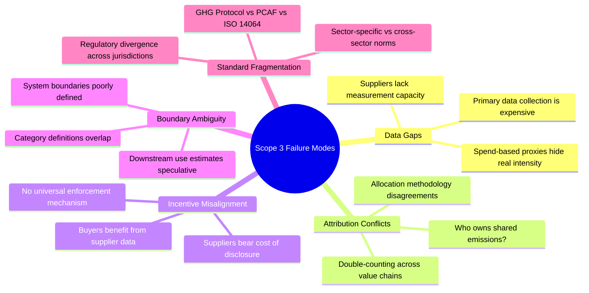

# Scope 3 Emissions: The Hardest Problem in Corporate Climate Action

## Guide Index

| File | Contents |
|------|----------|
| [00 Executive Summary](00_executive_summary.md) | This document — key insights, guide map |
| [01 Scope 3 Fundamentals](01_scope3_fundamentals.md) | GHG scopes, all 15 categories, boundary definitions |
| [02 Complexity & Challenges](02_complexity_challenges.md) | Why accounting is so hard — data, attribution, incentives |
| [03 Industry Case Studies](03_industry_case_studies.md) | Automotive, apparel, finance, food & ag — deep dives |
| [04 Abatement Challenges](04_abatement_challenges.md) | Why measuring ≠ reducing; decarbonization playbook |
| [05 Carbon3 Solution](05_carbon3_solution.md) | What carbon3.net proposes and how it addresses the gaps |
| [06 Standards & Regulatory](06_standards_regulatory.md) | GHG Protocol, PCAF, SBTi, CSRD, SEC, ISSB S2, VCMI, CSDDD, PACT |
| [07 Industry Data & Benchmarks](07_industry_data_and_benchmarks.md) | Real company data (1,391 companies), BCG/McKinsey/Bain research, VCM pricing |

---

## Executive Summary

### The Core Dilemma

Corporate climate pledges cover an average of **only 30–40% of a company's actual climate impact**. The remainder — buried deep in supply chains, customer use patterns, and financial portfolios — is Scope 3. It is invisible, contested, and almost universally underreported.

Scope 3 is not merely an accounting inconvenience. It is the terrain where the real decarbonization battle will be won or lost. For most companies across most sectors, **Scope 3 represents 70–90% of their total greenhouse gas footprint**. Automotive companies' Scope 3 is dominated by tailpipe emissions from vehicles they sold. Banks' Scope 3 is the carbon intensity of the loans and investments on their books. Apparel brands' Scope 3 is the cotton fields, dyeing mills, and shipping routes they never directly touch.

The challenge compounds itself: the entities that produce the most emissions often have the least incentive to disclose them, the least access to measurement tools, and the least capacity to change their processes.

### Why This Is Structurally Hard — Five Root Causes

**1. The Data Desert.** Most Scope 3 emissions are estimated, not measured. Tier-1 suppliers are difficult enough to engage; Tier-2 and beyond are almost impossible. The further upstream you go, the coarser the data. Most companies rely on spend-based emission factors — essentially multiplying invoiced spend by an average sector intensity — which can be off by **factors of 2–10x** from real emissions.

**2. The Attribution War.** A tonne of steel has emissions. When that steel becomes a car door, a building beam, and a wind turbine blade simultaneously — who owns the carbon? When an investment bank finances a refinery, how much of that refinery's emissions belong to the bank? These are not hypothetical questions; they determine the shape of every corporate net-zero target.

**3. The Incentive Trap.** Companies that buy from suppliers need those suppliers' emissions data. Suppliers who provide that data create accountability for themselves, potentially at competitive cost. Without regulatory mandates flowing upstream, voluntary disclosure is structurally asymmetric: buyers want data, suppliers have reasons not to provide it.

**4. The Boundary Problem.** The GHG Protocol defines 15 Scope 3 categories, but their edges are fuzzy. Category 11 (use of sold products) requires estimating how customers will use your product over its entire lifetime — a 15-year projection for a car, a 20-year projection for a building. These estimates are inherently speculative and depend on assumptions about energy grids, user behavior, and product retirement patterns that companies cannot control.

**5. Standard Fragmentation.** The GHG Protocol is the dominant framework, but the PCAF standard governs financial institutions, ISO 14064 governs project-level accounting, SBTi governs target-setting, and CSRD, SEC, and ISSB are creating three partially-divergent regulatory disclosure regimes simultaneously. A multinational company must satisfy all of them — and they do not always agree.

### The Decarbonization Gap

Even companies that account well for Scope 3 face a second, deeper problem: **knowing where your emissions are does not tell you how to reduce them.** The levers are:

- Supplier switching (requires verified alternatives exist)
- Product redesign (requires engineering investment and lifecycle thinking)
- Customer behavior change (nearly impossible to control)
- Green procurement (requires price premium tolerance)
- Insetting (abatement within your value chain, vs. offsetting outside it)

Each lever requires a different type of engagement, a different data infrastructure, and a different business case. Most companies have none of these systematically in place.

### What Good Looks Like (and Why We're Far From It)

| Maturity Level | Accounting Quality | Abatement Action | % of Fortune 500 |
|---------------|-------------------|------------------|------------------|
| Level 1: Absent | No Scope 3 disclosure | None | ~15% |
| Level 2: Awareness | Spend-based estimates for some categories | Ad hoc supplier engagement | ~45% |
| Level 3: Measurement | Hybrid/primary data for material categories | Supplier scorecards | ~30% |
| Level 4: Management | Near-complete coverage, verified data | Supplier decarbonization programs | ~8% |
| Level 5: Transformation | Real-time supply chain carbon intelligence | Embedded carbon pricing in procurement | ~2% |

### Key Insight for Executives

> The companies that will win the transition are not those who report Scope 3 best — they are those who build the operational infrastructure to *manage* it. Reporting is a lagging indicator. The leading indicator is whether your procurement, finance, product design, and supplier management functions are operating on carbon-aware data.

---

## How to Use This Guide

- **Executives and board members:** Read this summary and [04 Abatement Challenges](04_abatement_challenges.md). Focus on the maturity model and the section on SBTi target-setting implications.
- **Sustainability / ESG leads:** Start with [01 Fundamentals](01_scope3_fundamentals.md) then go deep on [02 Complexity](02_complexity_challenges.md) and [06 Standards](06_standards_regulatory.md).
- **Operations / procurement leaders:** The industry case studies in [03](03_industry_case_studies.md) will be most relevant, especially the supplier engagement diagrams.
- **Finance / risk teams:** [06 Standards](06_standards_regulatory.md) covers mandatory disclosure timelines and [03](03_industry_case_studies.md) covers PCAF and financed emissions.
- **Technologists and data teams:** [02 Complexity](02_complexity_challenges.md) maps the data architecture problem in detail.
