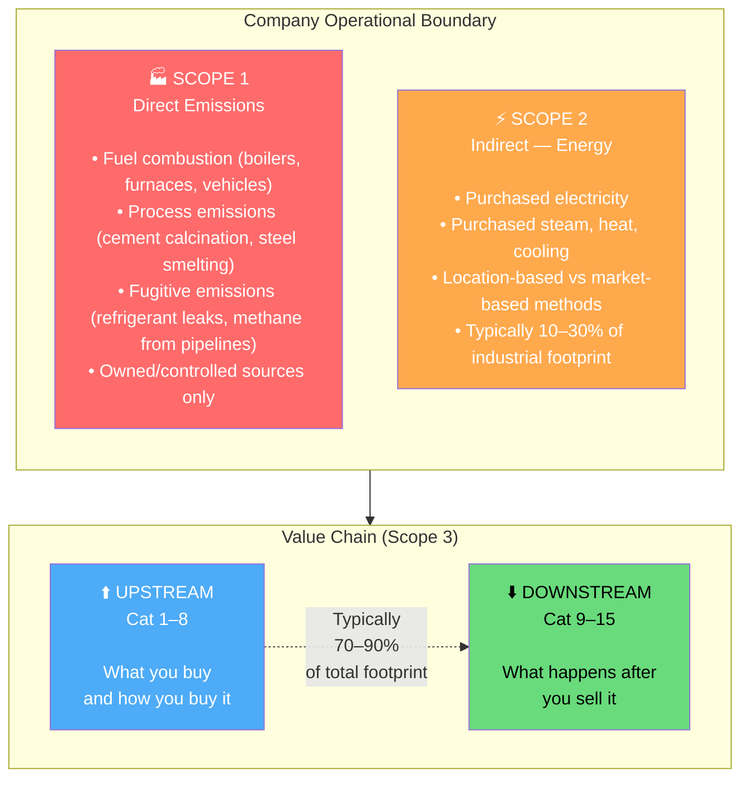
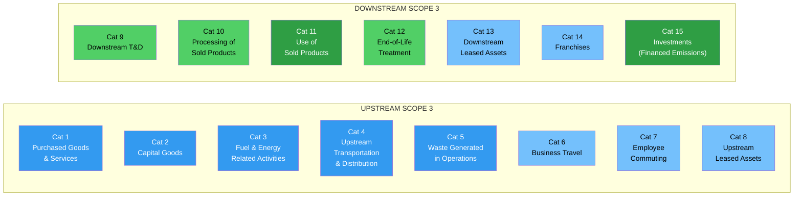
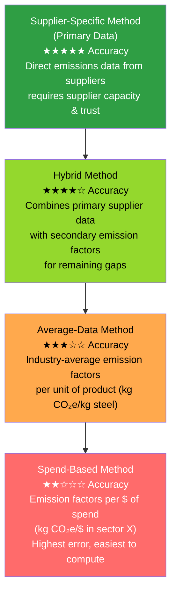
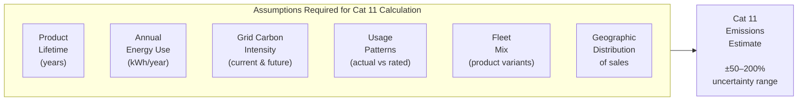
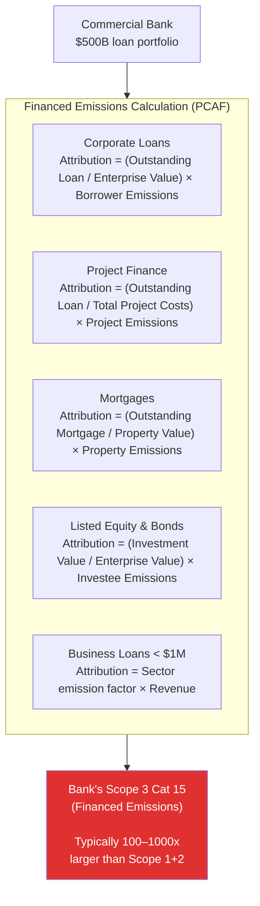
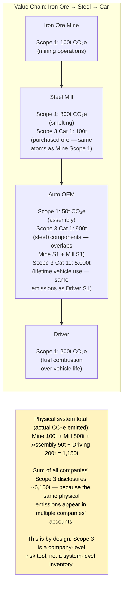

# Scope 3 Emissions: Fundamentals and Category Breakdown

## 1. The GHG Protocol's Three Scopes

The Greenhouse Gas (GHG) Protocol Corporate Standard — first published in 2001, revised in 2004, with the Scope 3 Standard added in 2011 — divides corporate emissions into three nested scopes. This architecture was designed to prevent double-counting *within* a company's boundary, though as we will see, it creates significant double-counting *across* company boundaries.

### Why Three Scopes?

| Scope | Rationale | Control Level | Typical % of Total |
|-------|-----------|--------------|-------------------|
| 1 | Direct operational control | Full | 5–15% |
| 2 | Purchased energy — contractually controllable | Partial | 5–20% |
| 3 | Value chain — influenceable but not controlled | Indirect | 70–90% |

The Protocol's logic: companies should fully account for what they directly control (Scope 1), should account for the carbon embedded in energy they choose to buy (Scope 2), and should *also* disclose the broader value chain impact (Scope 3) — even though they cannot directly control it.

This last requirement is where the complexity explodes.

---

## 2. The 15 Scope 3 Categories

The GHG Protocol's Scope 3 Standard (2011) defines 15 distinct categories, split into upstream (1–8) and downstream (9–15).

### Upstream Categories (1–8) — Detailed

#### Category 1: Purchased Goods and Services
The single largest Scope 3 category for most companies. All emissions associated with producing the goods and services a company buys — raw materials, components, professional services, IT, travel, consumables.

**Why it's hard:**
- Requires emissions intensity data from every supplier
- Most companies have thousands of suppliers across dozens of countries
- Emission factors vary enormously by production geography, technology vintage, and energy mix
- Services (consulting, legal, IT) have poorly defined emission factors

**Calculation methods (in decreasing order of accuracy):**

**Spend-based error range:** A spend-based factor for "basic iron and steel manufacturing" might be 0.8–2.4 kg CO₂e per dollar, depending on geography and the emission factor database used. Actual intensity can vary **3–10x** between a coal-powered Chinese steel mill and a hydrogen-reduced Swedish steel plant — both of which look identical in a spend-based model.

---

#### Category 2: Capital Goods
Emissions from producing capital equipment — machinery, buildings, vehicles, IT infrastructure. Often overlooked because capex is episodic, but can be material for capital-intensive industries.

**Key complexity:** How do you allocate the lifetime emissions of a piece of equipment to a single reporting year? The GHG Protocol says to attribute all capital good emissions to the year of acquisition — which creates lumpy, potentially misleading annual disclosures.

---

#### Category 3: Fuel- and Energy-Related Activities
Upstream emissions from fuel production (extraction, refining, transport) *not already captured in Scope 1 or 2*. Includes:
- Well-to-gate emissions for purchased fuels
- Transmission and distribution losses for electricity
- Extraction and transport of fuels used to generate purchased electricity

This is sometimes called "Scope 2.5" — it fills gaps between Scope 2 (combustion of purchased energy) and the full lifecycle of that energy.

---

#### Category 4: Upstream Transportation and Distribution
Emissions from transporting and distributing purchased goods — from supplier to the company's facility. Includes third-party logistics, rail, sea freight, air freight.

**Key tension:** The company *controls* which logistics providers it uses, but has limited data on their actual fuel consumption and load factors. Shipping companies vary enormously in carbon intensity per tonne-kilometer.

---

#### Category 5: Waste Generated in Operations
Emissions from waste disposal — landfill, incineration, wastewater treatment — for waste generated at company-operated facilities. Often a small category, but can be significant in food processing, chemical manufacturing, and construction.

---

#### Category 6: Business Travel
Employee travel by air, rail, car (non-company-owned vehicles), and hotels. Typically easier to measure (travel management systems hold booking data), but radiative forcing from aviation contrails is a significant area of scientific debate and methodological inconsistency.

**Radiative forcing factor:** Aviation emissions at altitude have an additional warming effect beyond CO₂ from fuel combustion — the IPCC estimates a radiative forcing index (RFI) of 2–4x. Some companies apply this; most do not. The GHG Protocol does not require it.

---

#### Category 7: Employee Commuting
Emissions from employees traveling to and from work. Requires survey-based estimates of commute distance, mode, and frequency. Work-from-home policies complicate this significantly — does remote work move emissions from Cat 7 to Cat 11 (home energy use)?

---

#### Category 8: Upstream Leased Assets
Emissions from assets leased by the company (as lessee) not captured in Scope 1/2. Relevant primarily for companies with large leased fleets, data centers in colocation facilities, or leased retail space.

---

### Downstream Categories (9–15) — Detailed

#### Category 9: Downstream Transportation and Distribution
Emissions from transporting sold products from the point of sale to end customers and between intermediaries. Particularly material for e-commerce companies, consumer goods, and distributors.

---

#### Category 10: Processing of Sold Products
Emissions from processing intermediate products sold to other businesses — e.g., a chemical company selling feedstocks that customers then process further. Requires understanding customers' manufacturing processes.

---

#### Category 11: Use of Sold Products
**The category that defines energy-transition-era Scope 3.**

For any company selling products that consume energy during their lifetime — cars, appliances, electronics, HVAC systems, industrial equipment — Category 11 captures *lifetime operational emissions* from those products in customers' hands.

**Why this is uniquely difficult:**

For an automotive OEM, Cat 11 is typically **85–95% of total Scope 3** and **75–85% of the company's entire GHG footprint** (Scopes 1+2+3). Reducing Cat 11 requires transitioning to EVs — but even EVs' Cat 11 depends on grid decarbonization that is outside the manufacturer's control.

---

#### Category 12: End-of-Life Treatment
Emissions from disposal or recycling of sold products at end of life. Companies must estimate product retirement rates, disposal methods by geography, and emissions from various waste treatment processes.

---

#### Category 13: Downstream Leased Assets
Emissions from assets owned by the company (as lessor) and leased to others. Real estate investment trusts (REITs) and commercial property companies face this as a major category.

---

#### Category 14: Franchises
Emissions from operations of franchisees. Material for companies like fast food chains (McDonald's, Subway), hotel chains, and retail franchises — where the corporate entity owns the brand but franchisees own the operations.

**Key problem:** Corporate cannot mandate emissions reporting standards on independent franchisees without creating legal risk around control/employment classification.

---

#### Category 15: Investments (Financed Emissions)
Emissions attributable to a company's equity investments, debt financing, and other financial services. This is the Scope 3 category that applies to banks, asset managers, insurance companies, and institutional investors.

Governed primarily by the **Partnership for Carbon Accounting Financials (PCAF)** standard, which extends the GHG Protocol for financial institutions.

For a major commercial bank, financed emissions are typically **100–1,000 times larger** than the bank's own operational emissions (Scopes 1 and 2). This means a bank's net-zero commitment is essentially meaningless without a credible plan to decarbonize its loan book.

---

## 3. Materiality — Which Categories Matter Most by Sector

Not every category is material for every company. The GHG Protocol requires companies to assess and disclose all material categories. What "material" means is frustratingly vague — the Protocol says a category is material if "it comprises a significant portion of total Scope 3 emissions, contributes to [company's] GHG risks, is important for reporting purposes, or is considered material by stakeholders."

*Note: The table below shows dominant category and share of total Scope 3 — not a single-axis comparison, as each sector's profile is multi-dimensional.*

| Sector | Dominant Category | % of Total Scope 3 | Secondary |
|--------|------------------|-------------------|-----------|
| Automotive OEM | Cat 11 (Use of sold products) | 85–95% | Cat 1 (steel, aluminum) |
| Apparel / Fashion | Cat 1 (Purchased goods) | 60–80% | Cat 4 (shipping) |
| Commercial Bank | Cat 15 (Financed emissions) | 95–99% | Cat 6 (business travel) |
| Food & Beverage | Cat 1 (Ag raw materials) | 50–80% | Cat 11 (cooking) |
| Software / Tech | Cat 1 (Hardware supply chain) | 40–70% | Cat 3 (data center energy) |
| Oil & Gas | Cat 11 (Combustion of sold fuels) | 70–90% | Cat 1, Cat 4 |
| Cement | Cat 1 + Cat 3 | 30–50% | Cat 11 |
| Real Estate | Cat 13 (Downstream leased) | 70–90% | Cat 2 (construction) |

---

## 4. The Double-Counting Problem

Scope 3 is designed to be a *company-level* accounting tool, not a *system-level* one. When you sum all companies' Scope 3 disclosures, you count most emissions multiple times.

This is not a bug in the Protocol — it is a deliberate design choice. Scope 3 is intended to give each company visibility into its *value chain risk*, not to produce system-level accounting. But it creates enormous confusion when aggregating disclosures, setting sector-level targets, or comparing company disclosures.

The implication for policy and markets: you cannot simply add up Scope 3 disclosures to understand economy-wide emissions. National GHG inventories (using the IPCC methodology) are the authoritative system-level account — and they do not map cleanly onto corporate Scope 3 boundaries.
