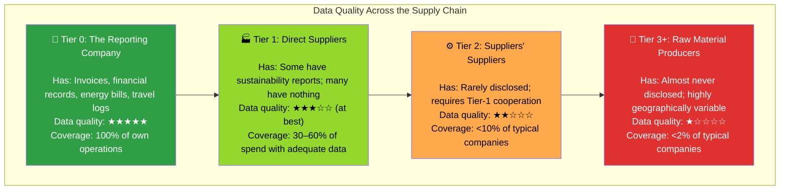
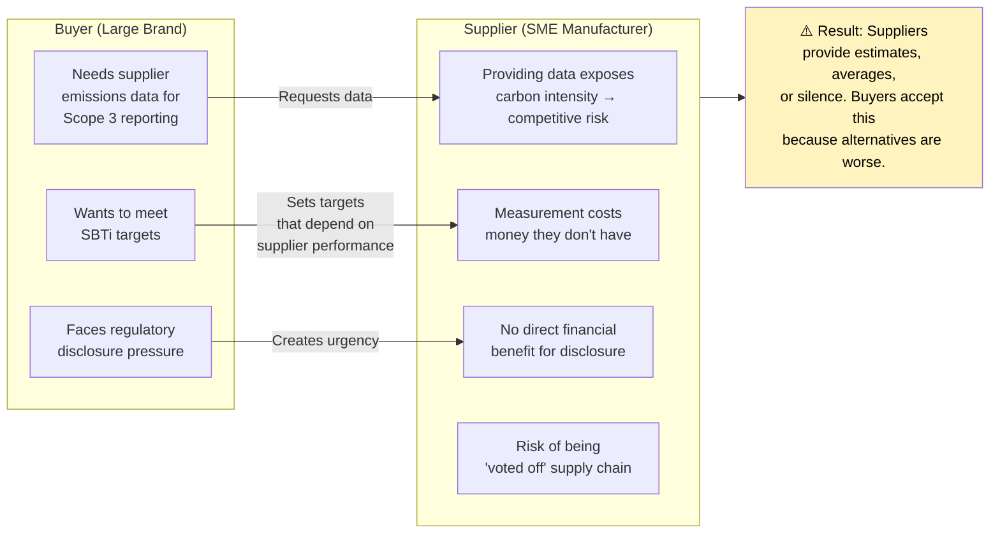
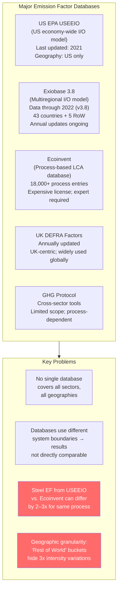
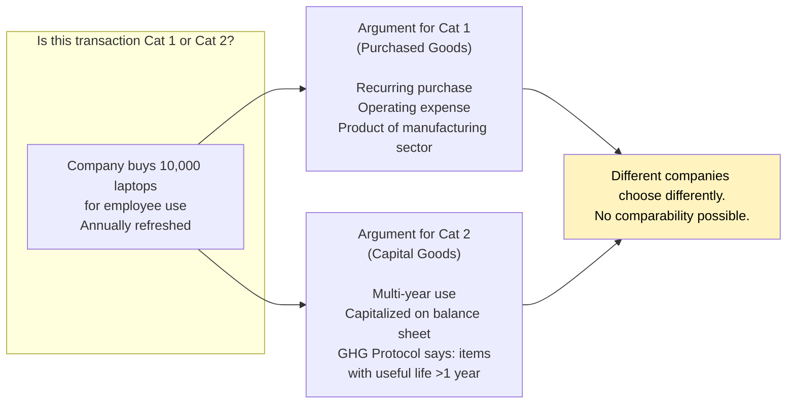
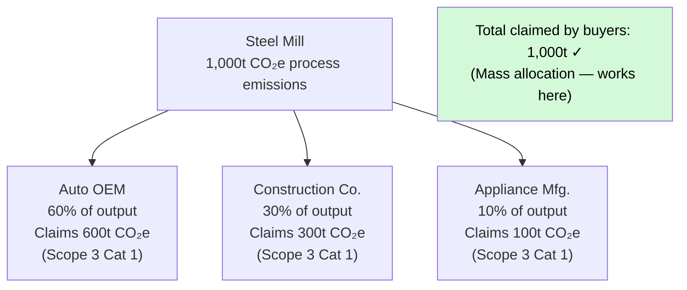
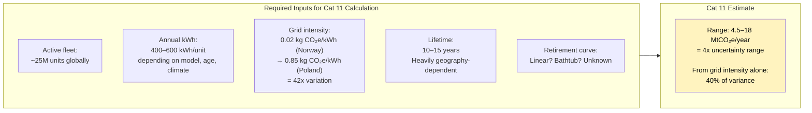
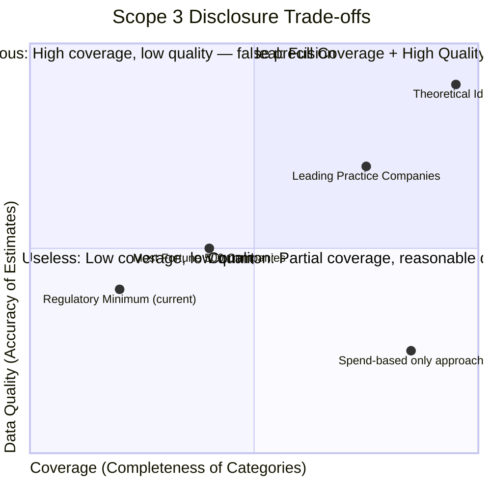
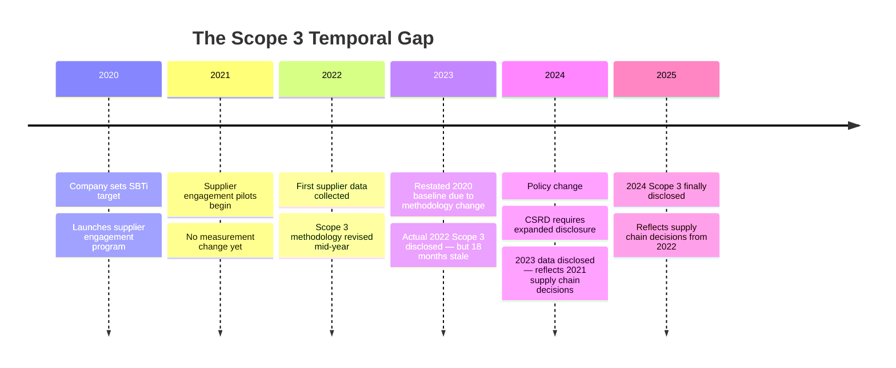

# Why Scope 3 Accounting Is So Hard: A Deep-Dive into Root Causes

## Overview

Scope 3 accounting is not merely difficult — it is *structurally* difficult. The challenges are not primarily technical (though technology matters); they are rooted in information economics, organizational incentives, system boundary design, and the fundamental nature of distributed global supply chains. This section maps the key failure modes with precision.

---

## Challenge 1: The Data Pyramid Problem

Every supply chain has a data quality pyramid. Data gets worse as you move upstream.



### Why this matters quantitatively

A consumer electronics company buying semiconductors has a supply chain that looks like:

```
Company → Contract Manufacturer (Tier 1) → Wafer Fab (Tier 2) → Chemical Supplier (Tier 3) → Mine (Tier 4)
```

The semiconductor fabrication step (Tier 2) is often the most energy-intensive part of the entire chain — some fabs consume as much electricity as a small city. Yet the reporting company has zero direct visibility into the fab's energy mix, which varies enormously depending on whether it is in Taiwan (high coal), South Korea (mixed), or the EU (increasingly renewable).

**Quantitative impact of data quality on accuracy:**

| Calculation Method | Typical Error Range | Data Requirement |
|-------------------|--------------------|--------------------|
| Supplier-specific (primary) | ±10–20% | Full supplier cooperation |
| Hybrid (partial primary) | ±25–50% | Tier-1 cooperation |
| Average-data (industry factors) | ±50–150% | Public emission factor databases |
| Spend-based | ±100–400% | Just financial data |

A company using spend-based methods — as most do — may report Scope 3 Cat 1 emissions that are off by a factor of 2–5. Worse, the error is not random: it is systematically *directional* because high-carbon suppliers in low-income countries often sell at lower prices per unit, making spend-based methods structurally *undercount* the most carbon-intensive sourcing relationships.

---

## Challenge 2: The Incentive Trap

The parties who hold the most valuable Scope 3 data — suppliers — have the least incentive to share it.



### The Asymmetric Burden

The GHG Protocol explicitly places Scope 3 accounting responsibility on the **buying company**, not the supplier. But the data lives with the supplier. This creates an information asymmetry where:

- The company responsible for reporting cannot directly observe what it needs to report
- The company that holds the data has no direct regulatory obligation to provide it
- The cost of providing accurate data (measurement, third-party verification, software) falls on the supplier
- The reputational benefit of that data flows to the buyer, not the supplier

This is a classic **principal-agent problem** — the agent (supplier) cannot be costlessly monitored by the principal (buyer), and the agent's interests diverge from the principal's.

**Who breaks this deadlock?** Three mechanisms exist, each partial:

1. **Contractual mandates:** Large buyers (Apple, Walmart, H&M) requiring suppliers to disclose emissions data as a procurement condition. Works for Tier-1 but enforcement degrades rapidly through tiers.

2. **Financial incentives:** Sustainability-linked supply chain finance (where suppliers get better lending rates for verified disclosures). Works but requires banking infrastructure.

3. **Regulatory mandates:** CSRD in the EU requires large companies to report on their suppliers, creating indirect pressure. Takes time to percolate; SME suppliers in non-EU jurisdictions remain outside scope.

---

## Challenge 3: Emission Factor Uncertainty and Database Fragmentation

Even when companies have spend and activity data, they must translate that data into CO₂ equivalents using **emission factors (EFs)** — conversion ratios like "kg CO₂e per dollar of steel" or "kg CO₂e per tonne-kilometer of ocean freight."

The problem: emission factor databases are inconsistent, geographically crude, and often years out of date.



### A Concrete Example: Ocean Freight

Shipping accounts for ~2.9% of global GHG emissions. For a company shipping goods from China to Europe, the emission factor depends on:

| Variable | Low-Carbon Scenario | High-Carbon Scenario | Factor Difference |
|----------|--------------------|--------------------|-------------------|
| Vessel age | Post-2020 (EEDI compliant) | Pre-2008 | 2.0x |
| Vessel size | VLCC (economies of scale) | Feeder vessel | 3.5x |
| Fuel type | LNG | Heavy fuel oil | 0.8x CO₂ (but +methane) |
| Load factor | 95% utilization | 50% utilization | 1.9x |
| Route | Direct | Via transshipment hub | 1.3x |

Typical EF database entry: "Ocean freight — general": 0.01–0.04 kg CO₂e / tonne-km. The range is **4x** within a single database entry. A company's actual freight emissions could fall anywhere in this range depending on their carrier's fleet characteristics — information they almost never have.

---

## Challenge 4: Boundary Ambiguity and Category Overlap

The GHG Protocol defines 15 categories, but their edges are fuzzy and categories can overlap depending on company structure and interpretation.

### Illustrative Conflicts:

**Conflict 1: Owned vs. Leased Assets**

A company that *owns* its delivery fleet reports fuel consumption in Scope 1. A company that *leases* an identical fleet reports it in Scope 3 Category 8 (upstream leased assets) or Category 9 (downstream transport). Two companies with economically identical operations report completely different Scope totals based purely on accounting structure.

**Conflict 2: Employee Commuting vs. Work-from-Home**

Pre-COVID: Employee commuting = Scope 3 Cat 7. Post-COVID, remote workers use home energy = Scope 3 Cat 7 or Cat 11? The GHG Protocol offers no clear guidance. Companies have adopted different approaches, making year-over-year comparisons and peer benchmarking unreliable.

**Conflict 3: Capital Goods vs. Purchased Goods**

The Protocol distinguishes Cat 1 (purchased goods: recurring) from Cat 2 (capital goods: equipment and infrastructure). But a cloud provider's servers are simultaneously: recurring purchases (Cat 1, updated hardware), capital goods (Cat 2, infrastructure), and potentially Scope 2 (if co-located)? The categorization affects materiality assessments and comparability across disclosure regimes.



---

## Challenge 5: The Attribution War — Who Owns Shared Emissions?

Many emissions are **shared** between multiple value chain participants. Allocation methodology is one of the most contested areas in Scope 3 accounting.

### The Steel Example

A steel mill processes iron ore into steel slabs. Those slabs are sold to: an automotive OEM (60% by mass), a construction company (30%), and an appliance manufacturer (10%).

The mill's process emissions: 1,000 tonnes CO₂e.



Mass allocation works cleanly when products are physical and homogeneous. It breaks down in:

- **Multi-product refineries:** A barrel of crude becomes gasoline, diesel, jet fuel, asphalt, petrochemicals. How do you allocate the refinery's process emissions across these products? By mass? By energy content? By market value? Each gives radically different answers.

- **Service sector:** A logistics company carrying 100 different customers' goods on one truck — how do you allocate the truck's fuel emissions across customers? Weight? Volume? Revenue?

- **Financial services:** A bank loan finances a conglomerate that operates in dozens of sectors simultaneously. The PCAF standard allocates by enterprise value, but this means a company with a high stock valuation gets *less* financed emissions attributed per unit of output than an identical company with a depressed valuation. Carbon is inversely proportional to market cap.

---

## Challenge 6: Downstream Speculation — Category 11 and Beyond

Scope 3 Categories 9–15 require companies to estimate what will happen *after* they sell their products. This is not accounting — it is long-range forecasting.

### The Use-Phase Problem

Category 11 (Use of Sold Products) requires estimating:

1. How many units of each product are in active use at any given time (requires fleet vintage models)
2. How much energy each unit consumes per year (rated consumption vs. actual use)
3. What energy source powers that consumption (grid electricity, which decarbonizes over time; fossil fuels, which do not)
4. Over what lifetime (product retirement curve)

For an appliance manufacturer selling refrigerators in 50 countries:



This uncertainty is not a failure of the accounting team — it is inherent to the calculation. The company *cannot* know what grid carbon intensity will be in the countries where its products are in use in 2030. They must choose an assumption.

Regulators and rating agencies have not converged on how this uncertainty should be disclosed, sensitivity-tested, or penalized.

---

## Challenge 7: The Disclosure Gap — Completeness vs. Accuracy Trade-off

Companies face a harsh choice when assembling a Scope 3 disclosure:



- **High coverage, low quality:** A company that uses spend-based methods for all 15 categories will have numbers for everything — but those numbers may be wrong by 200–400%. This creates an illusion of completeness.
- **Low coverage, high quality:** A company that measures only the categories where it has primary supplier data will produce accurate numbers — but only for 20–30% of its footprint. This is honest but incomplete.
- **The regulatory trap:** Emerging regulations (CSRD, SEC) require disclosure but don't specify minimum accuracy standards. Companies that disclose large but inaccurate numbers face less scrutiny than companies that disclose smaller, more accurate, but incomplete numbers.

This creates a perverse incentive: **maximize reported coverage at the expense of accuracy**. Spend-based methods serve this goal perfectly — they produce defensible numbers cheaply, even if they are meaningless for decision-making.

---

## Challenge 8: Temporal Mismatch

Scope 3 emissions are measured annually. But the supply chain decisions that determine future Scope 3 emissions are made over multi-year cycles.

- Procurement contracts: typically 1–5 years
- Capital equipment: 10–20 year operational lifetime
- Product design cycles: 2–5 years
- Supplier qualification: 6–18 months
- Land use change (deforestation): decades-long carbon debt

This means a company's Scope 3 footprint today reflects decisions made 3–10 years ago. Reductions made today will not appear in Scope 3 disclosures for 1–3 years (at minimum, due to supplier data lag). The feedback loop between action and measurement is too slow to drive operational decision-making.



By the time a company knows whether its decarbonization interventions are working, the window to course-correct for that annual disclosure has already closed.

---

## Challenge 9: The SBTi Target-Setting Paradox

Science Based Targets initiative (SBTi) is the gold standard for corporate climate target-setting. Companies commit to reducing emissions on a 1.5°C-aligned trajectory. But Scope 3 targets create a logical paradox:

- SBTi requires companies to include Scope 3 if it exceeds 40% of total (Scope 1+2+3) emissions
- For most companies, Scope 3 is 70–90% of total → SBTi inclusion is mandatory
- SBTi requires reducing *absolute* Scope 3 emissions by 90% by 2050 relative to a base year
- But Cat 11 emissions depend on grid decarbonization — which is *outside* the company's control
- And Cat 1 emissions depend on supplier decarbonization — which requires *systemic* change

**The result:** A company can meet 100% of its internal decarbonization targets (Scope 1 and 2) and still miss its Scope 3 SBTi target because the grid did not decarbonize fast enough or its suppliers did not invest in clean technology.

SBTi acknowledges this by allowing companies to set "engagement targets" for Scope 3 (e.g., "65% of suppliers by spend have SBTi targets by 2026") rather than absolute reduction targets — but engagement targets do not guarantee emission reductions, and cannot be directly measured against a 1.5°C budget.
