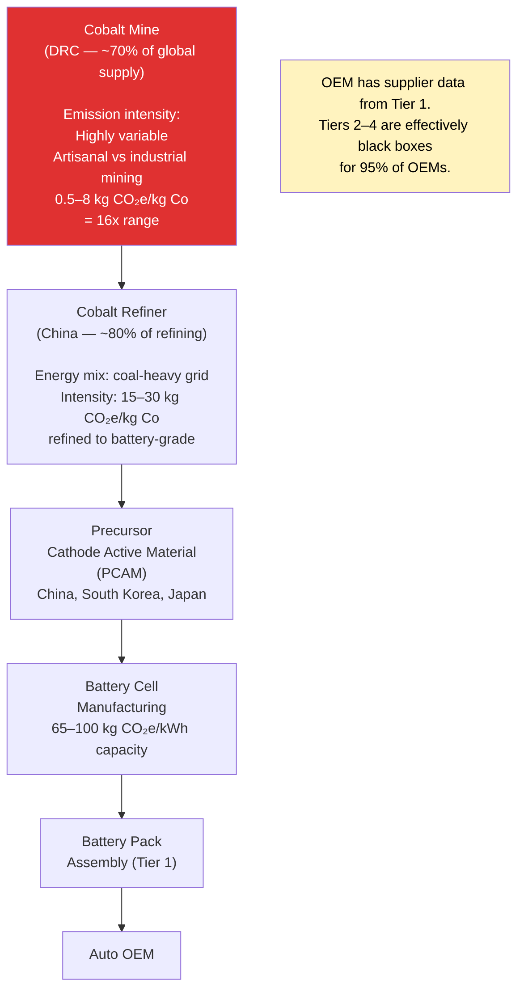
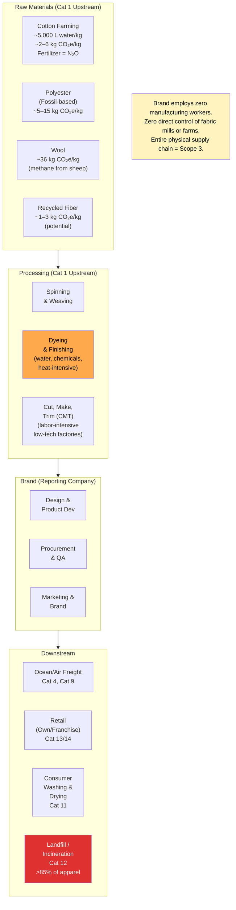
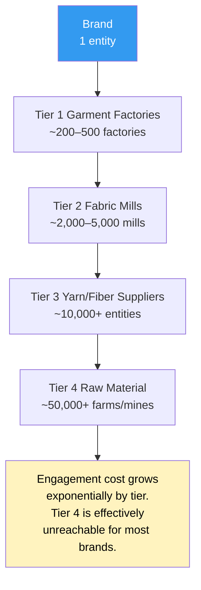
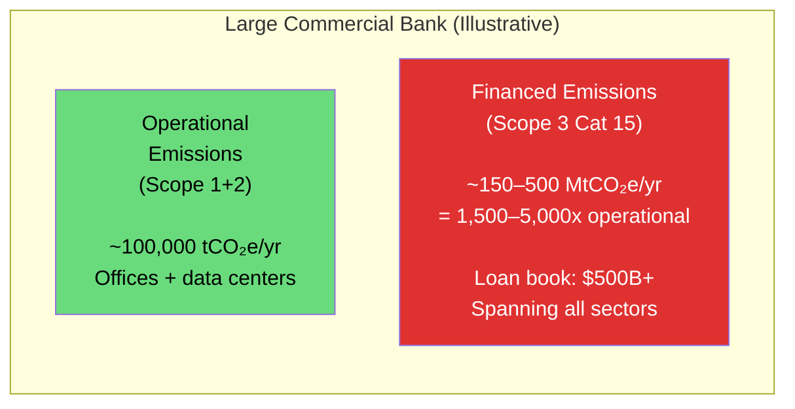
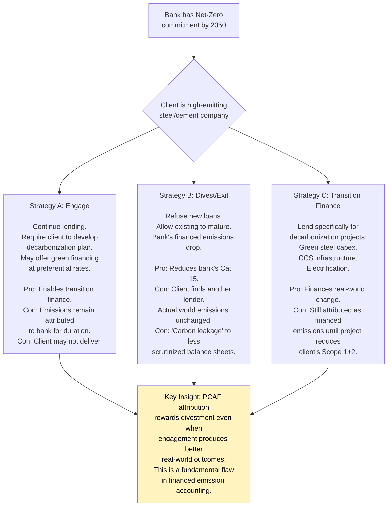
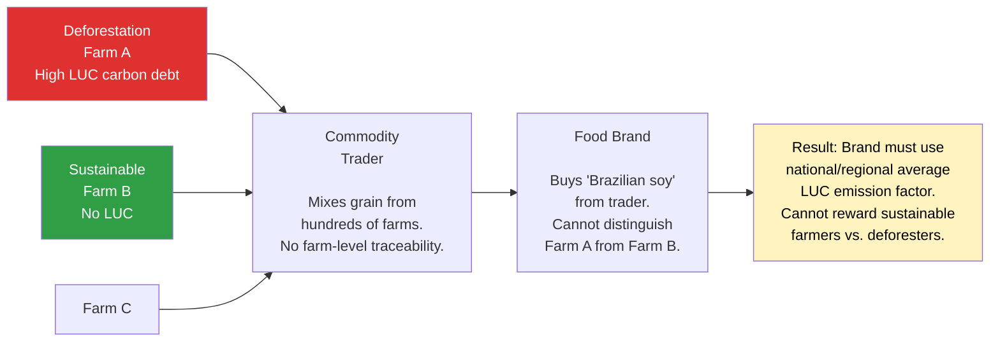
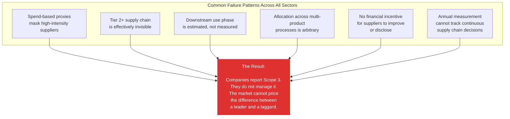

# Scope 3 in Practice: Industry Case Studies

## Overview

Abstract complexity becomes concrete when you trace specific supply chains. This section provides deep-dive case studies for four sectors where Scope 3 accounting is particularly challenging: automotive manufacturing, fashion/apparel, commercial banking, and food & agriculture. For each sector, we map the full value chain, identify the dominant emission categories, and explain why the standard approaches fail.

---

## Case Study 1: Automotive OEM

### Value Chain Map



```mermaid
flowchart LR
    subgraph T3["Tier 3+ Raw Materials"]
        Iron["Iron Ore\nMining"]
        Baux["Bauxite →\nAluminum"]
        Lith["Lithium/Cobalt\nMining (EVs)"]
        Petro["Petroleum →\nPlastics"]
    end

    subgraph T2["Tier 2 Processing"]
        Steel["Steel\nSmelting\n~1.8t CO₂/t steel\n(global avg)"]
        AlumF["Aluminum\nSmelting\n~11t CO₂/t Al"]
        Battery["Battery Cell\nManufacturing\n~30-100 kg CO₂/kWh\n(falling rapidly)"]
        Chem["Chemical\nSynthesis"]
    end

    subgraph T1["Tier 1 Component Suppliers"]
        Body["Body\nPanels"]
        Power["Powertrain\nComponents"]
        BattPk["Battery\nPacks"]
        Elec["Electronics\n& Sensors"]
        Int["Interior\nComponents"]
    end

    subgraph OEM["Auto OEM (Reporting Company)"]
        Manuf["Assembly\nPlant\nScope 1+2"]
        Log["Internal\nLogistics"]
    end

    subgraph DS["Downstream"]
        Deal["Dealerships\n& Distribution\nCat 9"]
        Use["Vehicle\nUse Phase\nCat 11\n~85% of total S3"]
        EoL["End of Life\nRecycling\nCat 12"]
    end

    T3 --> T2 --> T1 --> OEM --> DS

    note1["Cat 1 (upstream):\n~10-15% of total footprint"]
    note2["Cat 11 (use phase):\n~75-85% of total footprint"]

    style Use fill:#e03131,color:#fff
    style Battery fill:#ffa94d,color:#000
    style Steel fill:#ffa94d,color:#000
```

### Emissions Profile: Traditional ICE vs. BEV

| Category | Traditional ICE | Battery EV (grid: 2023 avg) | Battery EV (grid: 100% renewable) |
|----------|----------------|---------------------------|----------------------------------|
| Cat 1 (Steel, Al, components) | ~3 tCO₂e | ~3 tCO₂e | ~3 tCO₂e |
| Cat 1 (Battery production) | — | ~5–10 tCO₂e (falling; leading fabs 3–5t) | ~2–4 tCO₂e |
| Cat 11 (Use phase, 200k km) | ~35–45 tCO₂e | ~15–25 tCO₂e | ~2–5 tCO₂e |
| **Total lifetime** | **~40–50 tCO₂e** | **~25–38 tCO₂e** | **~8–12 tCO₂e** |

### The OEM's Scope 3 Accounting Challenges

**Challenge A: Cat 11 Projection Uncertainty**

A major OEM selling 3 million vehicles per year must estimate the lifetime emissions of those vehicles *at the time of sale*. This requires projections of:

- Grid carbon intensity in 40+ countries over 12–15 years
- EV adoption rate within its own fleet
- Driver behavior and annual mileage
- Vehicle retirement patterns

**Actual industry practice:** Most OEMs use IEA's Stated Policies Scenario (STEPS) for grid projections — which assumes modest policy continuation and does not model rapid decarbonization. Using STEPS vs. IEA's Net Zero Scenario can change Cat 11 estimates by **30–50%** for the same vehicle sold today.

**Challenge B: Battery Supply Chain (Tier 3+ Visibility)**

The cobalt supply chain for EV batteries illustrates the multi-tier data problem:



**Challenge C: The SBTi Paradox for OEMs**

An OEM with a 2030 SBTi target must reduce Cat 11 by 67% (1.5°C pathway). But Cat 11 is determined by:
1. The EV share of new vehicle sales (company controls this)
2. The carbon intensity of the electricity customers use to charge EVs (company cannot control this)
3. The pace of fleet turnover (customers decide when to buy new vehicles)

**Illustrative calculation:** If an OEM sells 3M vehicles/year and sets a Cat 11 target requiring 50% reduction by 2030:

- To achieve through EV mix alone: ~70–80% of new sales must be BEV by 2030 (even with significant grid decarbonization assumed)
- Current (2024) industry average: 15–20% BEV share
- The math requires the OEM to nearly quadruple its BEV penetration in 6 years — which depends on consumer adoption, charging infrastructure, grid capacity, and battery material supply chains that are largely outside its control

---

## Case Study 2: Apparel / Fashion Brand

### Value Chain Map



### The "Disintermediated Brand" Problem

Fast fashion brands like Zara, H&M, and Shein have almost no direct physical operations — they design, market, and retail. Every single step of physical production is in their Scope 3 (Category 1). The brand's entire climate impact is in its supply chain, and that supply chain:

- Spans 50–100+ countries
- Involves thousands of direct suppliers and tens of thousands of indirect ones
- Operates in jurisdictions with no carbon pricing or emissions reporting requirements
- Changes composition significantly each season

**The tier multiplication problem:**



### Dyeing and Finishing: The Hidden Hotspot

The dyeing and finishing stage — converting grey fabric to finished textile — is often the largest single-process emission source within apparel manufacturing, yet receives relatively little public attention.

| Process | Emission Driver | Typical Intensity |
|---------|----------------|-------------------|
| Pre-treatment (scouring, bleaching) | Heat + chemicals | 2–5 kg CO₂e/kg fabric |
| Dyeing | Heat (steam, hot water) + dye chemicals | 3–8 kg CO₂e/kg fabric |
| Finishing (coatings, water repellency) | Heat + fluorochemical treatments | 1–3 kg CO₂e/kg fabric |
| Wastewater treatment | Energy for treatment + methane from effluent | 0.5–2 kg CO₂e/kg fabric |

A fabric mill in Bangladesh running on coal-fired grid power has a dyeing intensity ~4–6x higher than an equivalent mill in Portugal with access to EU grid electricity. Yet both supply identical-looking fabric to a brand that uses an average fabric emission factor per kg.

### Consumer Use Phase: The Inconvenient Category 11

For a pair of jeans, the use phase (washing, drying, ironing over a 5-year life) can account for **30–40%** of total lifecycle emissions. A brand has essentially zero ability to change consumer washing behavior at scale. They can:

- Design for lower wash frequency (longer-lasting treatments)
- Label for cold-water washing
- Release consumer campaigns

None of these interventions can be measured and attributed to the brand's Cat 11 reduction. The category exists in the accounts but cannot be meaningfully managed.

---

## Case Study 3: Commercial Bank — Financed Emissions

### Why Banks' Scope 3 Dwarfs Their Other Emissions



### The PCAF Attribution Calculation in Practice

A bank with a $500M loan to an oil & gas company:

```
Company enterprise value (equity + net debt) = $20B
Outstanding loan = $500M
Attribution factor = $500M / $20B = 2.5%

Company Scope 1+2+3 emissions = 50 MtCO₂e/year

Bank's attributed financed emissions = 2.5% × 50 MtCO₂e = 1.25 MtCO₂e/year
```

This single loan generates financed emissions equal to **12.5 times** the bank's entire operational footprint.

### The Engagement vs. Divestment Dilemma



### The SME Lending Black Hole

Large corporate clients (Fortune 500) have Scope 1+2+3 disclosures that banks can use for PCAF calculations. But the majority of bank loan books by *count* (though not by value) consists of SME loans — companies with annual revenues of $1M–$50M that have never produced a GHG inventory.

For these loans, PCAF requires the "spend-based fallback" — essentially applying sector-average emission intensities. This produces numbers with **±200–500%** uncertainty, and provides no ability to track improvement over time.

**Illustrative coverage gap:**

| Loan Segment | % of Loan Book by Value | PCAF Data Quality | Confidence |
|-------------|------------------------|------------------|------------|
| Investment-grade corporates | 40% | Primary (Scope 1+2 disclosed) | High |
| Sub-investment-grade corporates | 20% | Secondary (some disclosure) | Medium |
| Mid-market companies | 25% | Mostly spend-based | Low |
| SME / Small Business | 15% | Spend-based fallback | Very Low |

A bank claiming "net-zero financed emissions by 2050" with 40% of its book in the "very low confidence" category is making a claim that is essentially unmeasurable with current data infrastructure.

---

## Case Study 4: Food & Beverage — Agricultural Emissions

### Why Agriculture Is Uniquely Difficult

Agricultural emissions are:
1. **Biogenic** — from living organisms (methane from cattle enteric fermentation, N₂O from fertilizer)
2. **Spatially distributed** — millions of farms across hundreds of geographies
3. **Highly variable** — same crop, different country, 5–10x emission intensity difference
4. **Not covered by most emission factor databases** — agricultural process emissions require specialized models (IPCC Tier 2/3)

```mermaid
flowchart LR
    subgraph Farm["Agricultural Production (Cat 1 - dominant)"]
        Rice["Rice Paddies\nMethane emissions\n~450 kg CO₂e/t rice\n(flooded cultivation)"]
        Cattle["Beef Cattle\nEnteric fermentation\n~25–50 kg CO₂e/kg beef\n(varies 2x by system)"]
        Dairy["Dairy\n~2–4 kg CO₂e/kg milk"]
        Soy["Soybeans\n~0.4–3 kg CO₂e/kg\n(huge deforestation risk)"]
        Coffee["Coffee\n~5–15 kg CO₂e/kg\n(processing + transport)"]
    end

    subgraph LUC["Land Use Change (Cat 1 - potentially catastrophic)"]
        Def["Deforestation\nfor new agricultural\nland\n\nPeat conversion =\n50–100 years of\ncarbon debt"]
    end

    subgraph Proc["Processing & Manufacturing"]
        Mill["Milling,\nBlending,\nPasteurization"]
        Pack["Packaging\n(plastics, glass,\naluminum)"]
    end

    subgraph Brand2["Food Brand"]
        R&D2["R&D +\nMarketing"]
    end

    subgraph DS2["Downstream"]
        Cold["Cold Chain\nLogistics"]
        Retail2["Grocery\nRetail"]
        Cook["Consumer\nCooking\nCat 11"]
        Waste["Food Waste\n(30–50% of\nfood produced)\nCat 12"]
    end

    Farm --> LUC
    Farm --> Proc
    LUC --> Proc
    Proc --> Brand2 --> DS2

    style Def fill:#e03131,color:#fff
    style Cattle fill:#ffa94d,color:#000
```



### The Deforestation Time-Bomb

Land use change (LUC) associated with agricultural expansion — particularly in tropical regions — releases enormous carbon stocks stored in forests, peatlands, and grasslands. A single hectare of tropical peatland drained for palm oil plantation can release **50–200 tCO₂e/year** for decades as the peat oxidizes.

Under current GHG Protocol rules, LUC emissions are allocated to the commodity produced on the land (palm oil, soy, beef). But:

- Attribution requires knowing *when* land was converted (pre- or post-1994 baseline?)
- Attribution requires satellite mapping of deforestation events linked to specific farms
- Most buyers have no visibility into which farms their commodities come from (especially through traders)



**Why this matters:** If a food brand sources soy from Brazil, should it use:
- Brazil national average soy LUC factor: ~3–5 kg CO₂e/kg soy
- Amazon biome average: ~8–12 kg CO₂e/kg soy
- Certified deforestation-free: ~0.3–0.8 kg CO₂e/kg soy

The range is **15–40x**. The choice of emission factor has more impact on the reported footprint than any supply chain intervention the brand could make in the near term.

### Food Waste: The Category No One Wants to Own

Approximately **30–40% of all food produced globally is wasted** — in production, transport, retail, and consumption. The emissions associated with producing that wasted food are not formally allocated to any Scope 3 category by most companies. They appear in Cat 12 (end-of-life treatment — methane from landfilled food) but the *upstream production emissions of the food that was wasted* are attributed to the food that was *consumed*.

This is a category-level attribution failure: the system does not capture the full cost of waste, which disincentivizes investment in waste reduction.

---

## Cross-Sector Summary: The Common Failure Patterns


