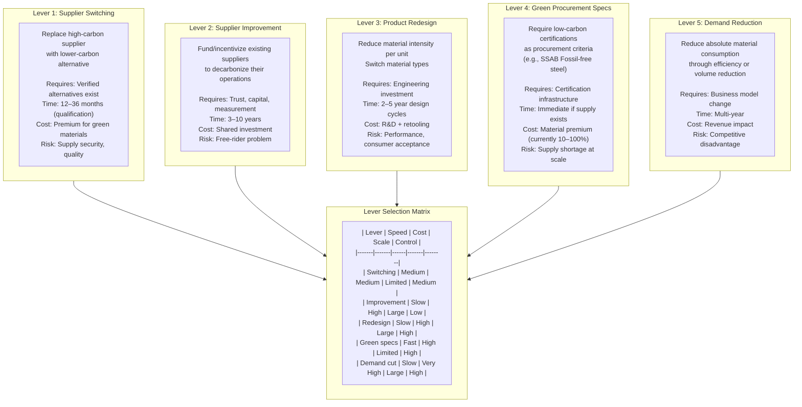
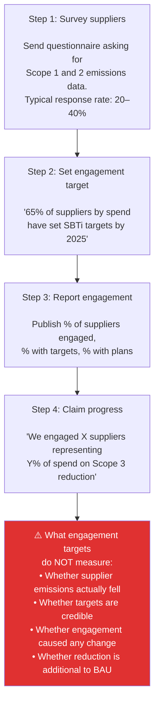
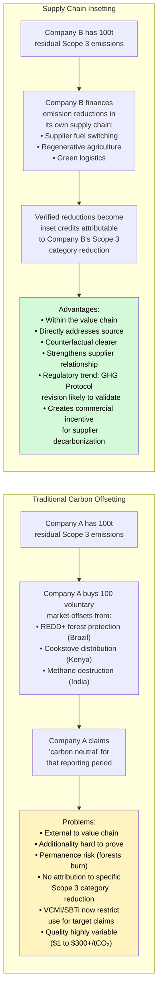
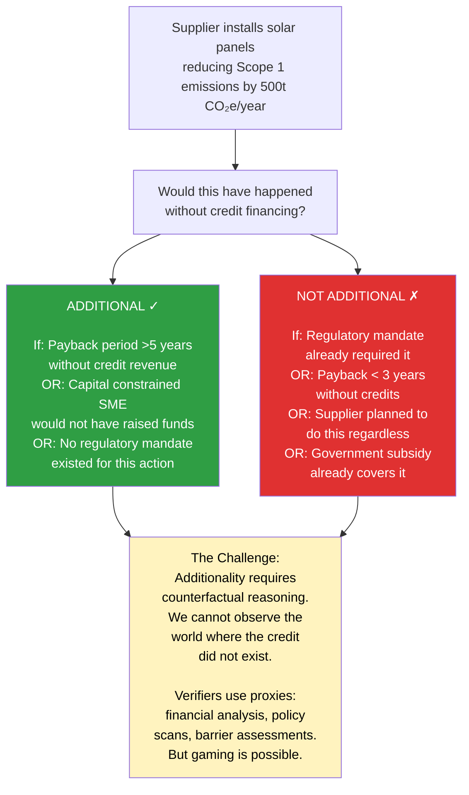
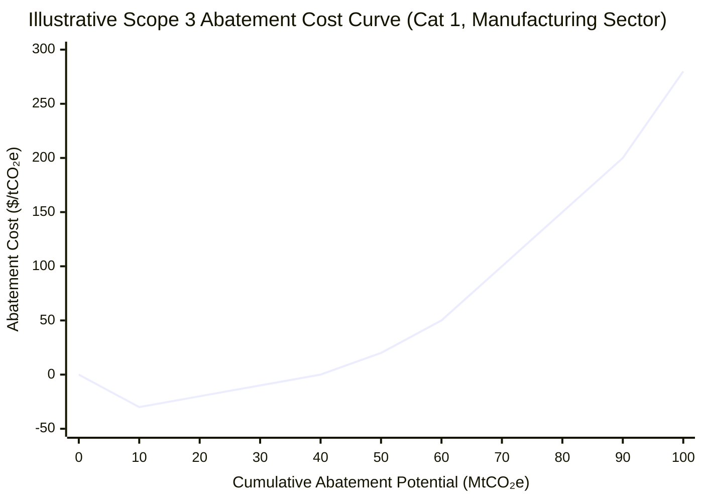
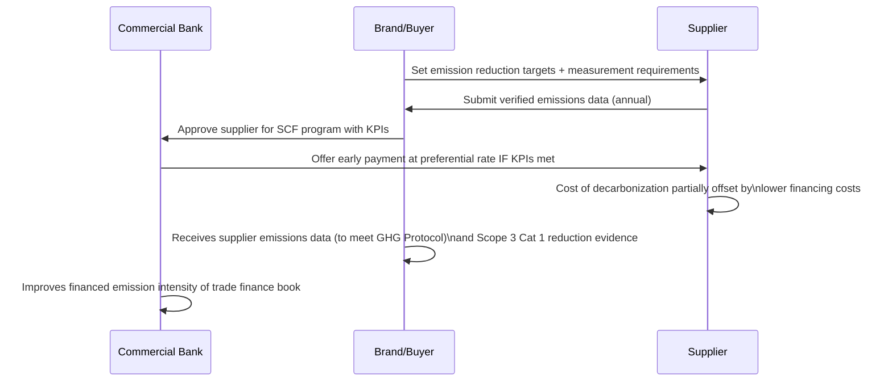
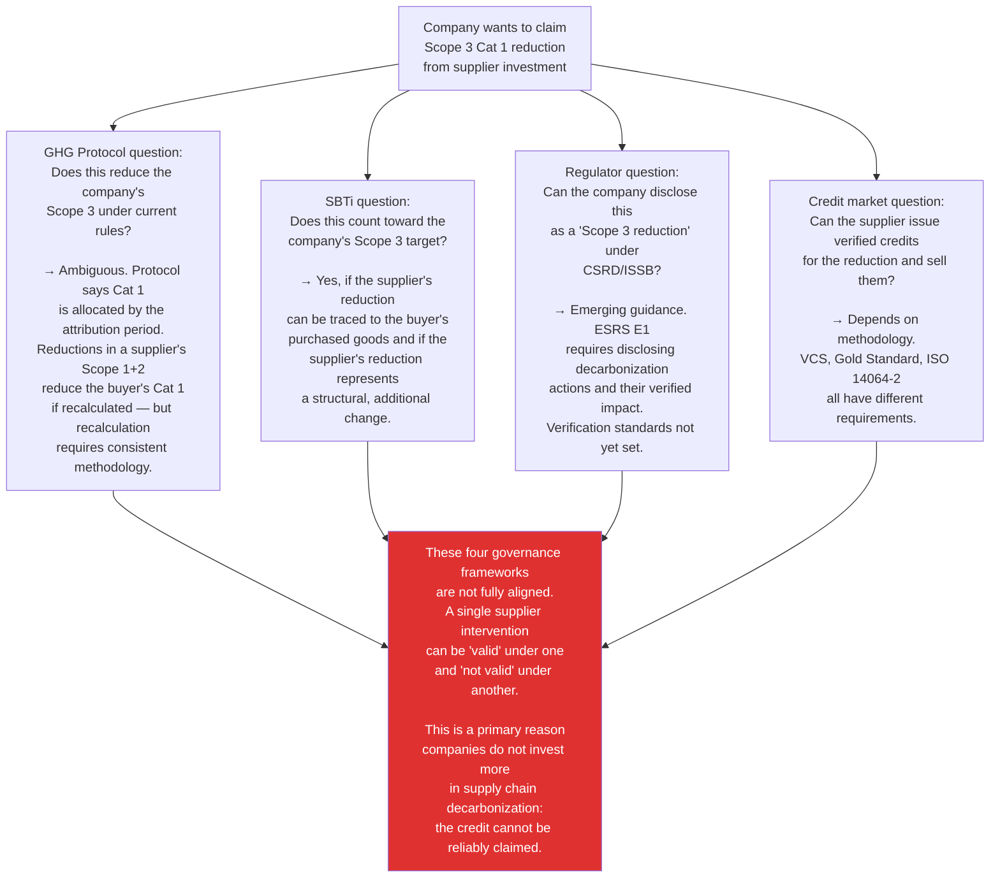
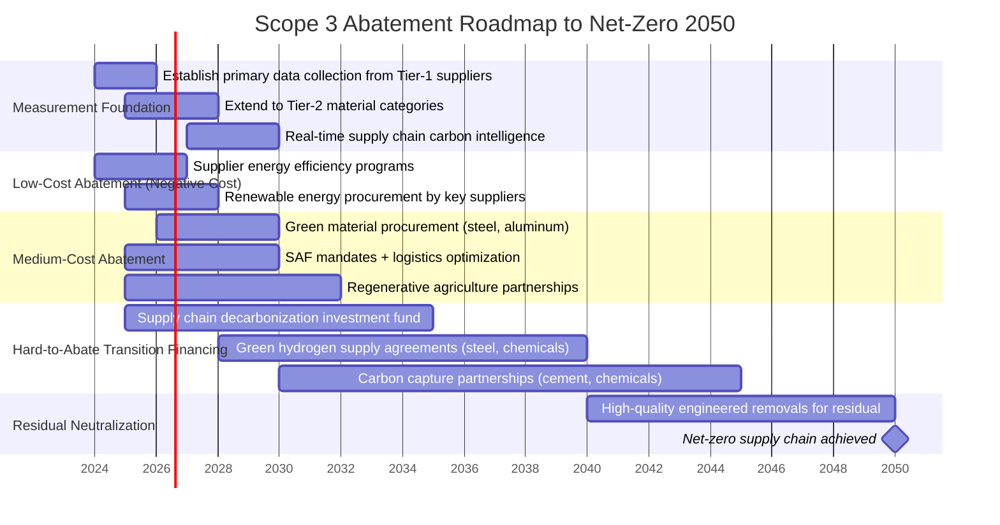

# Abatement and Decarbonization Challenges: Why Measuring Is Not Enough

## The Fundamental Gap

The most important insight in corporate climate action is this: **measuring Scope 3 emissions and reducing them are almost entirely different problems.** Most corporate sustainability programs are structured to solve the measurement problem. Almost none are structured to solve the abatement problem at the required speed and scale.

```mermaid
flowchart LR
    subgraph Measurement["Measurement Stack\n(Increasingly Solved)"]
        M1["GHG Protocol methodology"]
        M2["Emission factor databases"]
        M3["Carbon accounting software"]
        M4["Supplier data requests"]
        M5["Third-party verification"]
    end

    subgraph Gap["THE GAP\n(Mostly Unsolved)"]
        G1["💸 Who pays for\nsupplier decarbonization?"]
        G2["📊 How do buyers verify\nsupplier improvements?"]
        G3["🔄 How do reductions\nflow back to buyer's\nScope 3 account?"]
        G4["⚡ How do you finance\ncapex-intensive transitions\nin SME supply chains?"]
    end

    subgraph Abatement["Abatement Stack\n(Largely Absent)"]
        A1["Supplier decarbonization\nfinancing mechanisms"]
        A2["Verified reduction\ncredit infrastructure"]
        A3["Supply chain\ncarbon pricing"]
        A4["Procurement-linked\nclimate incentives"]
    end

    Measurement --> Gap --> Abatement

    style Gap fill:#e03131,color:#fff
```

---

## 1. The Decarbonization Lever Map

For any Scope 3 category, there is a finite set of abatement levers. Each lever has a different cost, time horizon, and feasibility profile.

### Category 1 (Purchased Goods & Services) Levers

### Category 11 (Use Phase) Levers

For products that consume energy during use (appliances, vehicles, electronics):

| Lever | Description | Company Control | Timeline |
|-------|-------------|----------------|----------|
| Product efficiency | Reduce energy consumption per unit of function | High | 2–5 year design cycle |
| Electrification of product | Switch from fossil fuel to electric (e.g., ICE→BEV) | High | 5–15 years (fleet turnover) |
| Grid decarbonization | Grid cleans up, reducing energy use emissions | None | Decades |
| Product lifetime extension | Longer-lived products = fewer new units' manufacturing emissions | Low-Medium | Dependent on consumer behavior |
| End-of-life design | Design for recyclability, reducing Cat 12 emissions | Medium | 2–5 year design cycle |

**The uncomfortable truth about Cat 11:** A company can do everything right — design the most efficient product possible, transition to full electrification — and still show *increasing* Cat 11 emissions if:
- The product portfolio grows (volume effect)
- The grid does not decarbonize on schedule (intensity effect)
- Consumer adoption of the more efficient product is slower than vintage product retirement

---

## 2. The Supplier Engagement Trap

The most common Scope 3 abatement strategy deployed by large companies is "supplier engagement." The typical program looks like:

**Why engagement fails to drive abatement:**

1. **No financial mechanism:** Engagement programs ask suppliers to invest in decarbonization without providing capital or guaranteed revenue to justify that investment.

2. **Target ≠ reduction:** A supplier can set a net-zero target and then miss it. SBTi validation takes time; annual verification of target progress is rare.

3. **Causality is unverifiable:** Even when a supplier reduces emissions during an engagement program, it is unclear whether the buyer's engagement caused the reduction or whether it would have happened anyway (business-as-usual energy savings, regulatory compliance, etc.).

4. **The free-rider problem:** Suppliers sell to multiple buyers. If Buyer A runs an engagement program that induces a supplier to install solar panels, Buyers B, C, and D also benefit from the reduced Scope 3 Cat 1 without paying for the program.

5. **The capacity gap at SMEs:** The vast majority of supplier decarbonization requests go to large Tier-1 suppliers. But Tier-1 suppliers may be assemblers who get their materials from hundreds of Tier-2 SMEs — where measurement capacity barely exists and investment in decarbonization is constrained by thin margins and capital access.

---

## 3. The Offset vs. Inset Debate

When companies cannot reduce Scope 3 emissions through supply chain interventions, they have historically turned to **carbon offsetting** — purchasing credits from external emission reduction projects to compensate for residual emissions.

### The Additionality Test: The Make-or-Break Question

Both offsets and insets must demonstrate **additionality** — the emission reduction would not have occurred without the financing provided by the credit buyer. This is fiendishly difficult to prove:

---

## 4. The Abatement Cost Curve

Not all abatement is equally costly. The McKinsey MACC (Marginal Abatement Cost Curve) framework, applied to supply chain Scope 3, reveals that abatement opportunities vary enormously by cost and potential:

| Intervention | Cost Range ($/tCO₂e) | Abatement Potential | Barrier |
|-------------|---------------------|--------------------|-|
| Supplier energy efficiency | -$30 to -$10 | Medium | Awareness, capital access |
| Renewable electricity (supplier) | -$10 to $20 | Large | Grid access, contract terms |
| Industrial heat electrification | $20 to $80 | Large | Capital, technology maturity |
| Green hydrogen (steel, chemicals) | $80 to $200 | Large | H₂ infrastructure, cost |
| Sustainable aviation fuel | $150 to $400 | Limited (supply) | Scale, feedstock |
| Direct air capture | $300 to $1,000+ | Theoretically unlimited | Cost, scale |

**The key insight:** The cheapest abatement opportunities (energy efficiency, renewable energy) are technically accessible today but blocked by **non-technical barriers**: capital access for small suppliers, split incentives between buyer and supplier, lack of measurement infrastructure, and absence of financial reward for early movers.

The expensive interventions (green hydrogen, DAC) are genuinely expensive because the technology is immature — but they are the only options for hard-to-abate industries at the end of the cost curve.

---

## 5. The Supply Chain Finance Bridge

One of the most promising emerging mechanisms for bridging the measurement-abatement gap is **sustainability-linked supply chain finance (SCF)**.

The mechanism:

**Why this is promising:**
- Creates financial reward for supplier disclosure and improvement (not just cost)
- Leverages existing supplier-buyer commercial relationship
- Bank gains access to scope 3 data for its own financed emission calculations
- Scales through procurement systems that buyers already operate

**Why this remains partial:**
- Only reaches suppliers large enough to use formal banking (excludes smallholder farmers, artisanal miners)
- Interest rate differential is modest (~50–150 basis points) — insufficient for large capex-intensive transitions
- Requires sophisticated financial infrastructure in geographies where it often doesn't exist
- Does not solve the multi-buyer attribution problem (supplier gets credit from Bank A but emits to Buyers B, C, D also)

---

## 6. The Abatement Governance Problem: Who Sets the Rules?

Even when a company identifies an abatement lever, multiple governance questions must be resolved:

---

## 7. The Hard-to-Abate Sectors: Where Standard Approaches Break Down

Several industrial sectors produce emissions that cannot be eliminated with current technology at reasonable cost — the so-called "hard-to-abate" sectors:

| Sector | Core Challenge | Abatement pathway | Timeline |
|--------|---------------|-------------------|---------|
| Steel | Process CO₂ from coke-based reduction of iron ore | Green hydrogen DRI; electrification | 2030–2045 |
| Cement | Process CO₂ from limestone calcination (~60% of total) | Carbon capture; supplementary materials; novel cement chemistry | 2035–2050 |
| Aviation | Energy density requirements; alternative fuels at early stage | SAF scale-up; hydrogen propulsion (long-haul: 2040+) | 2030–2050 |
| Shipping | Energy density; global bunkering infrastructure | Green methanol, ammonia, LNG bridge | 2030–2045 |
| Chemicals (feedstock) | Carbon is structural input, not just energy | Bio-based feedstocks; e-chemistry; mechanical recycling | 2030–2050 |
| Agriculture (methane) | Enteric fermentation from livestock | Feed additives (3-NOP); genetic selection; herd reduction | Near-term possible |

For companies buying from these sectors (which is most of the economy), the implication is stark: **Scope 3 Cat 1 from hard-to-abate suppliers cannot be reduced through procurement decisions alone.** The only paths are:
1. Finance the supplier's own transition (inset finance)
2. Accept the residual emissions and neutralize via high-quality removals
3. Exit the supply chain (economically and strategically often impossible)

This is precisely why a market mechanism that creates financial value for verified reductions within these supply chains is structurally necessary — not optional.

---

## 8. What "Net-Zero Supply Chain" Actually Requires

Working back from a 2050 net-zero economy, what does a company actually need to accomplish for its Scope 3?

The key observation: **Every phase of this roadmap requires a financial mechanism to direct capital from buyers toward supplier decarbonization.** The current tools — CSR budgets, supplier questionnaires, engagement programs — are insufficient by 2–3 orders of magnitude.

The missing piece is infrastructure that:
1. Verifies when a supplier has actually reduced emissions
2. Creates a transferable financial asset representing that reduction
3. Allows buyers to pay for that reduction in ways that create commercial incentive for suppliers
4. Connects this to recognized GHG Protocol and SBTi accounting frameworks

This is the structural gap that insetting infrastructure is designed to fill.
