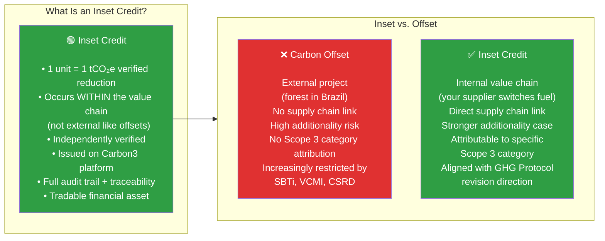
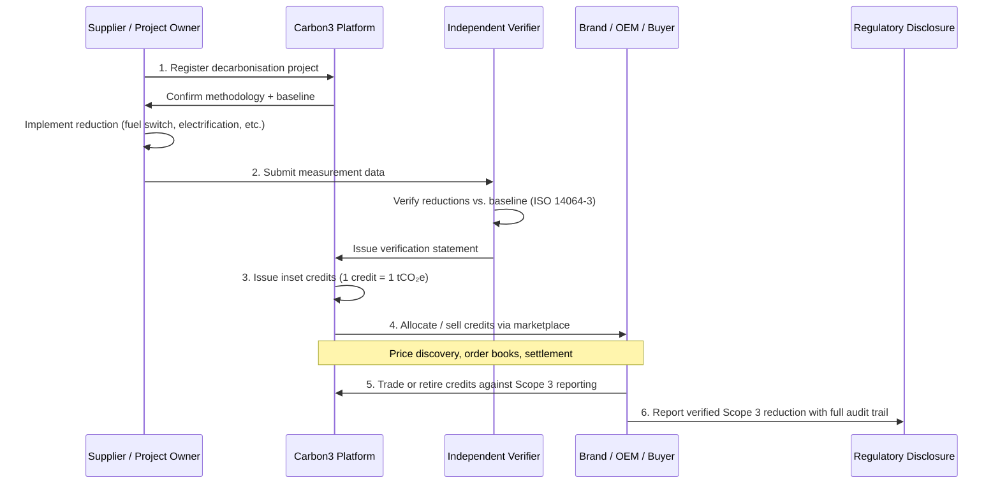
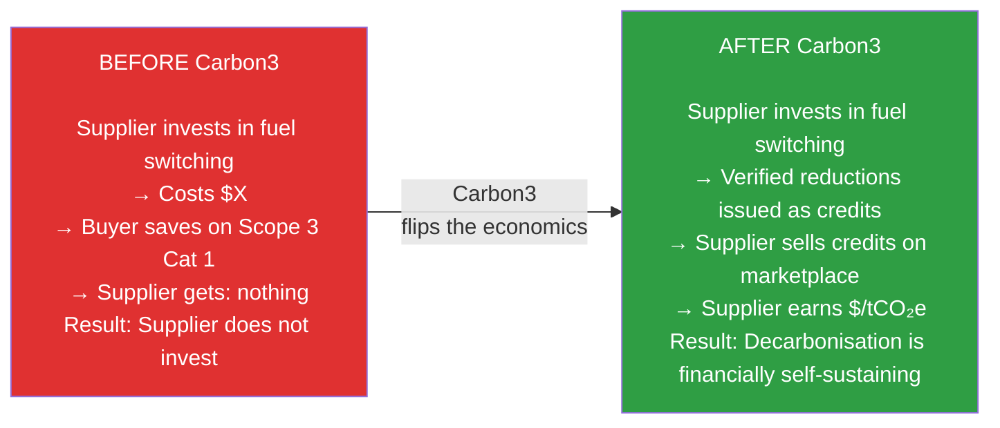
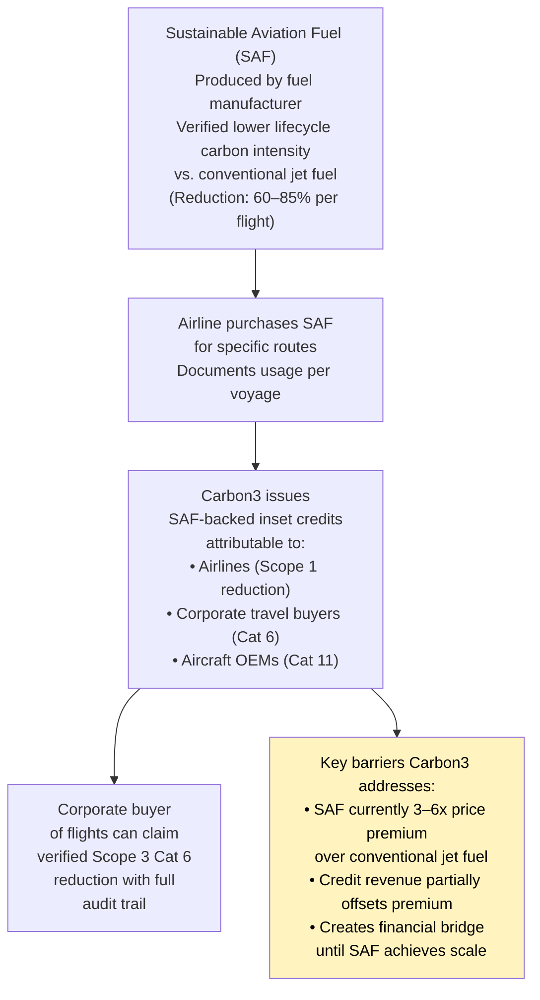
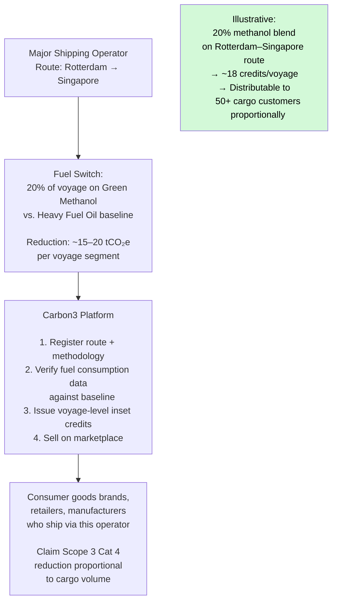
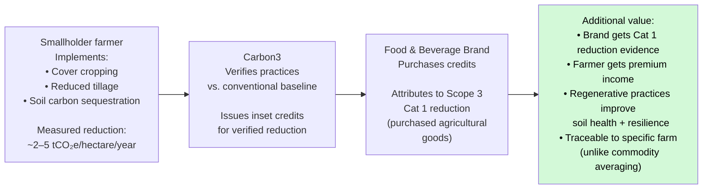
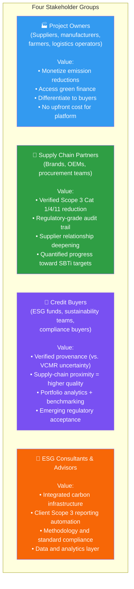
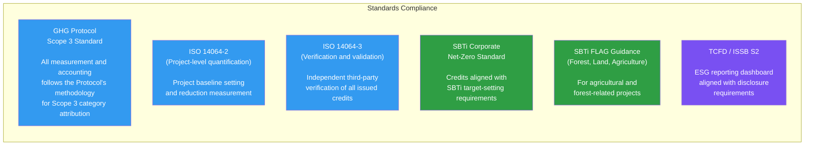
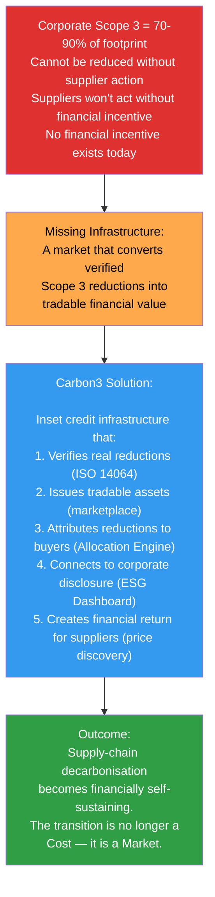

# Carbon3: Building the Market Infrastructure for Supply Chain Decarbonisation

## The Structural Problem Carbon3 Addresses

Every preceding section of this guide points toward the same structural gap. Companies know *where* their Scope 3 emissions are. They increasingly know *which levers* could reduce them. What they lack is a **market mechanism** that creates financial value for verified Scope 3 reductions and channels that capital to suppliers who can actually make them happen.

Carbon3 Global Pte. Ltd. is building that market infrastructure.

> **Mission:** "To build the market infrastructure that makes supply-chain decarbonisation financially self-sustaining."
>
> **Vision:** "A world where every verified tonne of Scope 3 reduction carries transparent market value — creating the incentive structures needed for deep industrial decarbonisation."

---

## 1. The Core Instrument: Inset Credits

Carbon3's primary innovation is the **inset credit** — a tradable financial instrument representing one verified tonne of CO₂ equivalent reduced within a company's supply chain.

### Why Insetting Is Higher Quality Than Offsetting

The GHG Protocol and SBTi have been progressively tightening the rules around offset use in corporate climate targets. The trend is clear: offsets are being restricted to residual emissions after all feasible reduction measures have been exhausted. Insetting, which directs finance toward reduction *within the value chain*, is structurally aligned with this direction.

| Dimension | Offsetting | Insetting (Carbon3) |
|-----------|-----------|-------------------|
| Location of reduction | External (outside value chain) | Internal (within supply chain) |
| Scope 3 category attribution | No — reduces "other" companies' emissions | Yes — directly reduces buyer's Scope 3 Cat 1, 4, etc. |
| Supplier relationship impact | None | Strengthens commercial relationship |
| Additionality verification | Distant, hard to observe | Closer, tied to commercial relationship |
| Supply chain intelligence | Zero | Generates ongoing emissions data |
| SBTi compliance | Restricted to residual | More likely to count toward targets |
| GHG Protocol status | Allowed as neutralization | Under consideration for Scope 3 reduction |
| Market value evolution | Declining (greenwashing concerns) | Rising (regulatory alignment) |

---

## 2. The Carbon3 Platform: Infrastructure Stack

Carbon3 provides the full technology and market infrastructure needed for inset credits to function as a liquid, trusted financial instrument.

```mermaid
flowchart TD
    subgraph Platform["Carbon3 Platform Infrastructure"]
        subgraph Layer1["Layer 1: Project Registry"]
            P1["Project Registration\n\nSupplier registers\ndecarbonisation project:\n• Fuel switching\n• Electrification\n• Regenerative agriculture\n• Marine fuel switch\n• Process efficiency"]
            P2["Baseline Setting\n\nEstablish pre-intervention\nemission intensity per unit\nof production output"]
        end

        subgraph Layer2["Layer 2: Measurement & Verification"]
            M1["Measurement\n\nReductions measured against\nestablished baseline using\nrecognised methodologies\n(ISO 14064-2, GHG Protocol)"]
            M2["Independent Verification\n\nThird-party auditor validates\nmeasurement and additionality\nper ISO 14064-3"]
        end

        subgraph Layer3["Layer 3: Issuance"]
            I1["Credit Issuance\n\nVerified reductions become\ninset credits with:\n• Unique identifier\n• Full audit trail\n• Methodology disclosure\n• Vintage (year of reduction)"]
        end

        subgraph Layer4["Layer 4: Market"]
            A1["Allocation Engine\n\nProprietary tool for\nassigning credits to specific\nsupply-chain relationships\n(buyer ↔ supplier)"]
            A2["Trading Marketplace\n\nLive marketplace with:\n• Price discovery\n• Order books\n• Transaction settlement"]
        end

        subgraph Layer5["Layer 5: Reporting"]
            R1["ESG Reporting Dashboard\n\nAutomated Scope 3 reporting\naligned to:\n• GHG Protocol\n• TCFD\nWith full traceability per credit"]
            R2["Data & Analytics\n\nMarket pricing data\nPortfolio analytics\nBenchmarking"]
        end
    end

    Layer1 --> Layer2 --> Layer3 --> Layer4 --> Layer5

    style Platform fill:#f8f9fa,color:#000
```

### The Six-Stage Inset Credit Lifecycle

---

## 3. How Carbon3 Solves the Root-Cause Problems

Mapping Carbon3's solution against the structural challenges identified in this guide:

### Problem 1: No Financial Incentive for Suppliers to Decarbonise

**The mechanism converts decarbonisation from cost center to value generator.** For an SME supplier that cannot access green finance or dedicate internal resources to sustainability, the ability to monetize verified emission reductions changes the business case fundamentally.

### Problem 2: Buyers Cannot Verify Supplier Reductions

The Carbon3 platform's independent verification process (ISO 14064-3) creates a trusted, auditable record that a specific reduction occurred. The full audit trail from project registration through credit issuance gives buyers defensible evidence of Scope 3 reduction for regulatory disclosure.

### Problem 3: No Market Mechanism for Pricing Supply Chain Carbon

Carbon3's marketplace creates **price discovery** for supply chain emission reductions — the first liquid market mechanism for this asset class. This matters for:

- **Buyers:** Can see what verified supply chain decarbonization is worth and budget accordingly
- **Suppliers:** Have a market exit for credits, reducing investment risk
- **Financiers:** Can provide project finance against expected credit revenue streams
- **Investors:** Can acquire and hold a portfolio of inset credits as an ESG asset

### Problem 4: Accounting Attribution Is Unclear

Carbon3's approach directly addresses the Scope 3 accounting ambiguity:

| Carbon3 Credit Attribute | Scope 3 Accounting Benefit |
|--------------------------|---------------------------|
| Supply-chain-specific (buyer ↔ supplier) | Attributable to specific Scope 3 category |
| ISO 14064-2 methodology | GHG Protocol-compatible measurement |
| ISO 14064-3 verification | Meets emerging assurance requirements |
| Full audit trail | Satisfies CSRD traceability requirements |
| SBTi FLAG + Corporate Net-Zero alignment | Usable toward SBTi target claims |

---

## 4. Target Sectors: Where Carbon3 Creates the Most Value

### Aviation

Aviation sits at an interesting intersection of scopes. An airline's own fuel combustion is its **Scope 1**. For *aircraft manufacturers* (Boeing, Airbus), Cat 11 covers the lifetime fuel burn of the aircraft they sell — making Cat 11 typically 85–95% of an OEM's total footprint. For *corporations whose employees fly*, those flights appear as **Scope 3 Cat 6 (Business Travel)**. And for the airline itself, its own supply chain (purchased fuel, aircraft manufacturing) is Scope 3 Cat 1/2.

Carbon3's aviation inset credit mechanism:

### Maritime

Shipping is responsible for ~2.9% of global GHG emissions. The International Maritime Organization (IMO) targets net-zero by 2050. The maritime sector provides the clearest existing proof-of-concept for inset credits at scale: **DP World's Insetify programme** (launched UK January 2025, expanded to Belgium, Portugal and Sweden April 2026) has already issued 9,000+ tonnes CO₂e in credits across 250,000+ TEUs using Bureau Veritas certification and the Smart Freight Centre methodology — demonstrating that the operational infrastructure for maritime insets is viable today (see [Section 10 of Industry Data & Benchmarks](07_industry_data_and_benchmarks.md) for full case study).

Carbon3's maritime application goes beyond DP World's current model in two ways: a **tradeable marketplace** with price discovery (DP World's certificates are non-transferable), and fuel switching beyond biofuels to green methanol and ammonia — which have greater abatement potential and stronger long-run additionality.

### Steel and Cement (Hard-to-Abate Industry Finance)

For hard-to-abate sectors where reduction costs are high:

- A steel mill switching partially to hydrogen-based direct reduction iron (H-DRI) takes on significant capex
- Carbon3 credits provide a revenue stream that improves the business case for the investment
- Buyer (automotive OEM, construction company) purchases credits for verified lower-carbon steel
- This creates a market mechanism that was previously missing: **the buyer pays a premium for green steel not through the price of steel but through the credit market**

This has a crucial advantage: it keeps the commodity market integrated (the buyer can still competitively procure steel) while creating a separate channel to finance the carbon transition.

### Agriculture (Regenerative Farming)

For food companies facing Cat 1 deforestation and agricultural emissions:

---

## 5. Stakeholder Value Creation

Carbon3 creates value across four distinct stakeholder groups:

---

## 6. Standards Compliance and Credibility Architecture

Carbon3's credibility rests on compliance with the authoritative standards stack:

### Additionality: The Core Verification Test

Carbon3's additionality framework ensures credits represent genuine new reductions:

> "Emissions reductions must demonstrate they would not occur without credit financing incentives."

This is tested through:
1. **Financial additionality:** Is the intervention financially viable without credit revenue? (Projects that would happen regardless are excluded)
2. **Regulatory additionality:** Is the intervention required by existing law? (Legally mandated reductions are excluded)
3. **Technology/barrier test:** Are there non-financial barriers (infrastructure, awareness, capacity) that the project overcomes?

---

## 7. Critical Analysis: Open Questions and Genuine Risks

A rigorous analysis requires honest examination of the challenges Carbon3 must navigate. The inset credit model is structurally compelling but operates in an environment where several foundational questions remain genuinely unresolved. Expert readers should weight these risks carefully.

### Challenge A: The GHG Protocol Revision — The Existential Question

The most significant unresolved issue for the inset credit model is whether the **revised GHG Protocol** will allow buyers to claim a supplier's verified Scope 1 reduction in their own Scope 3 accounts.

The current Protocol does not explicitly address this. Two plausible outcomes from the revision:

| Outcome | Implication for Carbon3 |
|---------|------------------------|
| **Favorable:** Revised Protocol creates a "supplier reduction transfer" mechanism (analogous to market-based Scope 2 accounting) | Core value proposition validated. Buyers can directly claim inset credits as Scope 3 Cat 1 reductions. Market demand for credits is fully justified. |
| **Unfavorable:** Revised Protocol holds that reductions remain in supplier's Scope 1 accounts; buyers can only benefit through lower emission factors for purchased goods over time | Buyers cannot *immediately* claim an inset credit as their own Scope 3 reduction. Credits have value for supplier decarbonization financing but not as buyer accounting instruments. |

**The honest assessment:** Both outcomes are plausible. The revision process includes advocates for both positions, and the final standard's language will determine the entire shape of the inset credit market. Carbon3's business model is positioned for the favorable outcome — but this is a bet on a regulatory process, not a settled fact. Companies considering significant inset credit purchases should treat this as a near-term accounting risk.

The ISO 14064-2/3 compliance provides a verification standards foundation regardless of Protocol outcome — but verification methodology is separate from accounting treatment.

### Challenge B: Double Attribution — The REC Analogy Is Imperfect

Carbon3's unique registration and retirement system prevents a supplier from *selling* a credit and also *claiming the same reduction* in their own Scope 1 accounts. This is correct and important.

However, the REC (Renewable Energy Certificate) analogy has limits. With RECs, the accounting mechanism is codified in the GHG Protocol Scope 2 Guidance — when a company buys a REC, it explicitly gives up the right to claim renewable electricity in its own Scope 2 under the market-based method. The standard is explicit and universally accepted.

For inset credits, **no equivalent provision exists in the GHG Protocol today.** Until the revision creates explicit rules about how suppliers "transfer" reductions to buyers and how this appears (or does not appear) in the supplier's own accounts, buyers using inset credits for Scope 3 claims are operating in an area where auditors and standard-setters may apply inconsistent treatment. This is a real near-term risk for CSRD assurance engagements.

### Challenge C: Additionality Erosion from Policy Tightening

Carbon3's additionality standard correctly excludes interventions that are legally mandated or would happen without credit financing. However, **policy is tightening fast** in major manufacturing jurisdictions:

- The EU's Fit for 55 package, ETS extension to shipping and industry, and Carbon Border Adjustment Mechanism (CBAM) are creating regulatory requirements that will make many currently-additional interventions legally mandated within 3–7 years
- In China, mandatory energy efficiency standards for industrial facilities are raising the baseline
- In the US, the IRA's production tax credits for clean hydrogen and SAF may make some interventions financially viable without credit revenue

**The implication:** Carbon3's project pipeline (fuel switching, electrification, renewable energy) faces a shrinking additionality window as policy advances. Projects that are additional today may not be additional in 2028. This requires continuous monitoring of the regulatory baseline — and may push Carbon3 toward harder-to-abate interventions (green hydrogen, CCS) where policy is further from mandating action, but project economics are more challenging.

### Challenge D: Market Pricing — Current VCM Conditions Are a Warning

The guide has referenced a "market price" of $20–$50/tCO₂e for inset credits. This should be understood as aspirational rather than observed. Context:

- Voluntary carbon market prices for nature-based offsets collapsed to $2–$8/tCO₂e in 2023–2024 following quality scandals (REDD+ projects, avoided deforestation methodology questions)
- High-quality industrial credits (cookstoves, renewable energy) command $15–$40/tCO₂e in established markets
- Supply-chain-specific inset credits are not yet a liquid, standardized market — price formation depends on buyer-seller negotiation and bilateral deals
- For hard-to-abate sectors (green hydrogen steel, CCS cement), the gap between credit revenue at any plausible price and the actual abatement cost ($150–$300/tCO₂e) means credits alone cannot fund the transition; they can only be a contribution to a larger financing stack

**The realistic near-term use case:** Carbon3's strongest initial value is for interventions where the incremental cost of decarbonization is below $50/tCO₂e — renewable energy transitions, fuel switching, regenerative agriculture, logistics efficiency. For harder-to-abate sectors, inset credits are one component of a blended finance approach, not a standalone funding mechanism.

### Challenge E: The Multi-Buyer Attribution Problem

When a supplier has 10 buyers, the emission reduction from a fuel switch benefits all 10's Scope 3 Cat 1. Carbon3's Allocation Engine enables one (or several) buyers to purchase the corresponding credits — but this creates a rational first-mover problem:

*Why should Buyer A pay for an inset credit that improves the supply chain they share with Buyers B–J, who get the Category 1 improvement (via lower supplier emission factor) without paying?*

This is not solved by the credit mechanism alone — it requires either exclusive allocation (the paying buyer gets to claim the full reduction), contractual requirements that all major buyers co-fund, or regulatory mandates that align costs with benefits. In competitive procurement markets, first-mover disadvantage is a real barrier to adoption.

### Challenge F: Verification Cost Economics for SMEs

ISO 14064-3 verification for a project typically costs $20,000–$100,000+. For a small supplier generating 1,000 tCO₂e/year in reductions, verification cost alone consumes 20–100% of credit revenue at $20/tCO₂e. Carbon3 must develop:
- Lightweight verification protocols for small-volume projects
- Programme methodologies that aggregate multiple similar small projects under one verification cycle (similar to Gold Standard's PoA framework)
- Technology-based monitoring that reduces auditor time requirements

This is a solvable operational challenge but requires significant methodology investment.

### Challenge G: Competitive Landscape

Carbon3 is not alone in building supply-chain carbon market infrastructure:
- **SustainCERT** (affiliated with Gold Standard) builds supply-chain verification for corporate buyers
- **The PACT Network** (WBCSD) builds product-level PCF sharing infrastructure that could reduce demand for credit intermediaries if primary data flows directly
- **LEAF Coalition** addresses nature-based supply chain finance
- **Pachama and Terrasos** serve nature-based supply chain credits

Carbon3's differentiation is the marketplace + allocation engine combination, the breadth of sector coverage, and the Singapore financial infrastructure focus. But the competitive dynamics will intensify as regulatory clarity improves market attractiveness.

---

**Summary of Risk Assessment:**

| Risk | Severity | Timeline | Mitigation |
|------|----------|----------|------------|
| GHG Protocol revision (unfavorable) | Critical | 2025–2026 | Monitor actively; lobby for favorable outcome; ISO 14064 foundation provides floor |
| Double attribution accounting gap | High | Near-term | Requires Protocol revision to resolve fully; disclose in credit documentation |
| Additionality erosion from policy | Medium | 3–7 years | Move toward higher-cost hard-to-abate projects as lower-cost ones become mandated |
| Market pricing below abatement cost for H2/CCS | High | Ongoing | Position as blended finance component, not standalone for hard-to-abate |
| Verification cost economics | Medium | Near-term | Develop PoA-style program methodologies |
| First-mover disadvantage | Medium | Near-term | Exclusive allocation or contractual co-funding arrangements |
| Regulatory recognition (CSRD assurance) | Medium | 1–3 years | Detailed audit trail designed for assurance review |

---

## 8. The Bigger Picture: Why Carbon3 Is Necessary

The math of corporate net-zero is unambiguous:

- Companies cannot reach net-zero by 2050 without addressing Scope 3
- Scope 3 cannot be addressed without supplier decarbonisation
- Supplier decarbonisation requires capital
- Capital requires a financial return
- A financial return requires a market

**Carbon3 is building that market.** The inset credit mechanism is not a nice-to-have sustainability feature — it is the critical financial infrastructure that makes the supply-chain decarbonisation economy possible. Without it, the gap between corporate net-zero commitments and supply chain reality will continue to widen until the commitments become meaningless.

