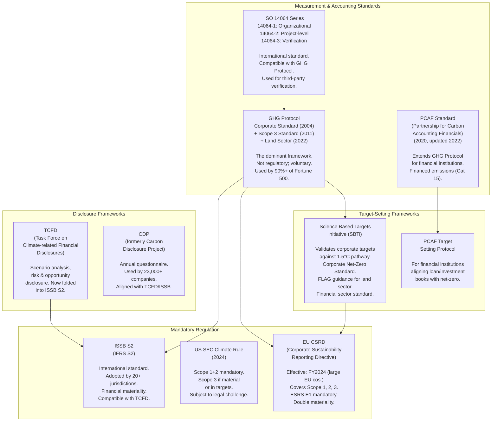
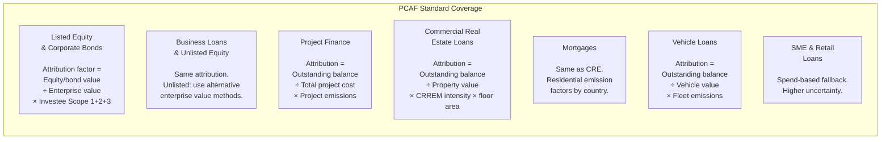
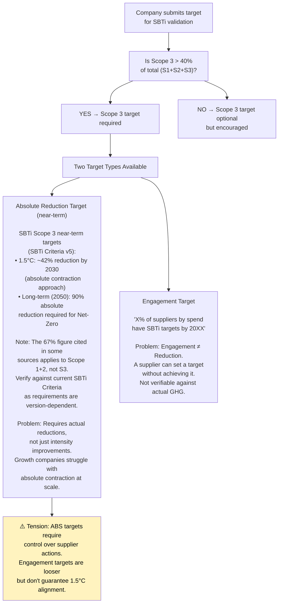
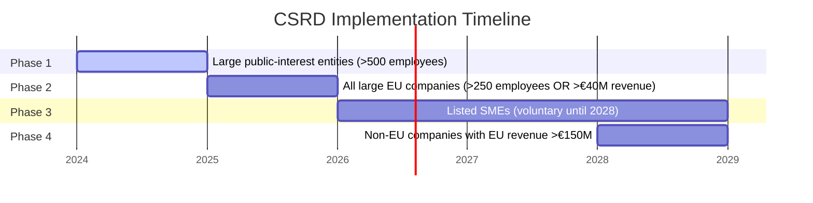
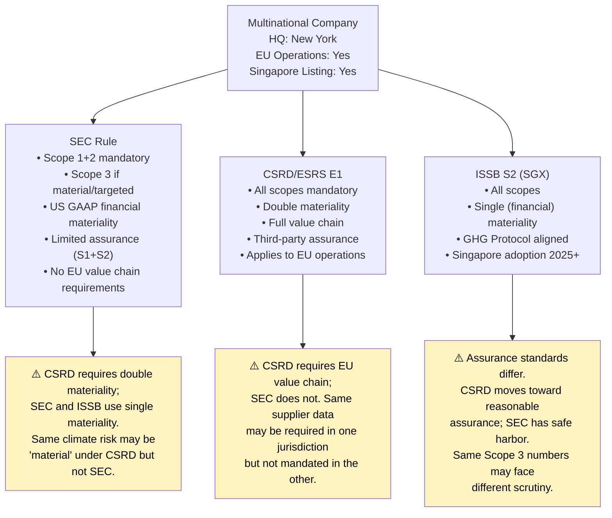

# The Standards and Regulatory Landscape

## Overview

The Scope 3 standards landscape is simultaneously over-complicated and under-enforced. Multiple frameworks govern how companies measure, report, and set targets for Scope 3 emissions — and they do not fully align with each other. Meanwhile, three major regulatory regimes (CSRD, SEC, ISSB) are creating partially divergent mandatory disclosure obligations that companies must satisfy simultaneously.

---

## 1. The Framework Map

---

## 2. The GHG Protocol — The Foundation

Published by the World Resources Institute (WRI) and the World Business Council for Sustainable Development (WBCSD), the GHG Protocol is the closest thing the corporate world has to a universal carbon accounting standard.

### Key Documents

| Document | Year | Scope |
|----------|------|-------|
| Corporate Standard | 2004 | Scope 1, 2, 3 at org level |
| Scope 3 Standard | 2011 | 15 categories, methodology |
| Corporate Value Chain (Scope 3) Calculation Guidance | 2013 | Sector-specific methods |
| Land Sector & Removals Guidance | 2022 | LULUCF, carbon removal |
| Scope 2 Guidance | 2015 | Market-based vs location-based |

### Critical Limitations

1. **Not mandatory:** The GHG Protocol is a voluntary framework. Companies can claim GHG Protocol compliance while making methodology choices that dramatically affect reported numbers.

2. **No verification requirement:** Unlike financial accounting, the GHG Protocol does not require third-party verification. Many companies disclose without any assurance.

3. **The materiality escape hatch:** Companies must report "material" Scope 3 categories — but "material" is self-assessed. This allows companies to exclude large emissions sources by declaring them immaterial.

4. **Spending-based latitude:** The Protocol explicitly permits spend-based estimation as a valid method, even though it is the least accurate. This creates a compliance path that requires minimal supplier engagement.

5. **Under revision (GHG Protocol Update — 2025):** The GHG Protocol is undergoing its first major revision since 2011. Key debates: how to handle carbon removals, how to treat near-term vs long-term targets, and whether the Scope 2 market-based method creates perverse incentives. Outcome expected 2025–2026.

---

## 3. PCAF — The Financial Sector Extension

The Partnership for Carbon Accounting Financials (PCAF) Standard provides the methodology for financial institutions to measure and disclose their **financed emissions** (Scope 3 Category 15).

### Why PCAF Is Critical

Financial institutions are unique: their Scope 1 and 2 emissions are trivially small (office buildings, data centers), but their financed emissions — the carbon intensity of their loan and investment portfolios — are enormous. A single large commercial bank may have financed emissions of 100–500 MtCO₂e/year while its direct operational footprint is <0.1 MtCO₂e/year.

### PCAF Asset Class Coverage

### PCAF's Known Weaknesses

1. **Enterprise Value Attribution Anomaly:** Attribution is proportional to financial ownership stake. A company with a high market capitalization gets *less* financed emissions attributed per unit of borrowing than a company with depressed valuation — making green companies "look worse" and potentially distressed fossil fuel companies "look better."

2. **Double Counting by Design:** When a bank provides both equity and debt to the same company, both positions generate financed emission attributions. There is no netting — this is intentional (they represent different financial risk relationships) but makes headline financed emission numbers look large.

3. **Portfolio Coverage Gap:** Even leading banks can only calculate financed emissions for 60–80% of their loan book by value. SME and retail segments lack the data infrastructure to calculate entity-level emissions.

4. **Data Currency Lag:** Investee emissions data disclosed today covers performance from 12–24 months ago. Banks' financed emission portfolios reflect the state of their clients' operations one to two years prior.

---

## 4. SBTi — The Target-Setting Gold Standard

The Science Based Targets initiative validates corporate emission reduction targets against climate science. As of early 2026, over 9,000 companies had committed to or set SBTi targets, with SBTi's own credibility facing scrutiny following internal governance disputes in 2024.

### SBTi Requirements for Scope 3

For companies where Scope 3 > 40% of total footprint (which is most companies):

### SBTi's Financial Sector Standard

Released in 2024, the SBTi Financial Institutions Standard requires banks, asset managers, and insurers to set SBTi-aligned targets for their financed emissions. Key requirements:

- Cover at least 20% of portfolio by emissions (scaling to 100% by 2040)
- Use PCAF attribution methodology
- Set absolute or intensity-based targets sector by sector
- Prioritize "engagement" with high-emitting clients before divestment

**Critical debate:** Does client engagement constitute a credible net-zero strategy, or does it enable continued financing of high-emission activities while creating reputational cover? This is the central fault line in the financial sector climate debate.

---

## 5. CSRD — The EU's Mandatory Disclosure Regime

The EU Corporate Sustainability Reporting Directive (CSRD) is the most comprehensive mandatory Scope 3 disclosure requirement currently in effect.

### Timeline and Coverage

### Key CSRD Scope 3 Requirements (ESRS E1)

- **Mandatory disclosure** of Scope 1, 2, and 3 emissions (all material categories)
- **Double materiality assessment:** Companies must assess both financial materiality (impact of climate on the company) and impact materiality (impact of the company on climate)
- **Value chain disclosure:** Must cover upstream and downstream value chains, including supplier-level data where available
- **GHG reduction targets:** Must be disclosed with methodology, timelines, and interim milestones
- **Third-party assurance:** Initially limited assurance; moving toward reasonable assurance (audit-level) by 2028

### CSRD vs. GHG Protocol Compliance Gaps

| Area | GHG Protocol | CSRD/ESRS E1 |
|------|-------------|--------------|
| Verification | Optional | Mandatory (limited assurance) |
| Materiality assessment | Self-assessed | Double materiality, disclosed methodology |
| Value chain coverage | Self-determined | Must justify exclusions |
| Base year restatement | Recommended | Required with thresholds |
| Scope 3 specificity | Category-level | Sub-category and activity-level |

---

## 6. SEC Climate Rule — Finalized but Effectively Paused

> **Status as of early 2026:** The SEC climate disclosure rule, finalized in March 2024, has been substantially weakened and its key provisions — including Scope 3 — are functionally paused under the current US administration. The SEC withdrew its defense of the rule in federal court in 2025. US companies should not treat this as a live near-term disclosure obligation. The rule is documented here for context because it shaped market expectations and may be revived or replaced in future administrations.

The original rule's architecture, which informed market expectations:

- **Scope 1 and 2:** Would have been mandatory for all SEC registrants above a de minimis threshold
- **Scope 3:** Required only if material to the registrant OR if included in a published climate target or transition plan
- **Safe harbor:** Scope 3 disclosures would have had a good-faith safe harbor from SEC enforcement
- **Assurance:** Scope 1+2 would require limited assurance for accelerated filers; no Scope 3 assurance requirement

**Why it still matters structurally:** Even with US federal rollback, many US multinationals face Scope 3 disclosure requirements through: (1) CSRD obligations for their EU operations; (2) California's Climate Corporate Data Accountability Act (SB 253, effective 2026), which requires Scope 3 disclosure for companies with >$1B revenue doing business in California; and (3) investor pressure that has not diminished despite regulatory retreat. The US regulatory gap increases the relative competitive pressure from EU-based rivals operating under CSRD.

**The California factor:** SB 253 effectively creates de facto federal disclosure standards for large US companies because the California market is too large to exit. This state-level requirement may prove more durable than federal rulemaking in the current political environment.

---

## 7. ISSB S2 (IFRS S2)

The International Sustainability Standards Board (ISSB) issued IFRS S2 in June 2023, which is now being adopted by jurisdictions representing over 55% of global GDP.

- Based on TCFD framework (TCFD disbanded in 2023, with ISSB as successor)
- Requires Scope 1, 2, 3 disclosure using GHG Protocol
- Financial materiality lens (single materiality) vs. CSRD's double materiality
- Adopted by: Australia, UK, Canada, Singapore, Japan, Brazil, Nigeria, and others

**Convergence vs. divergence:** ISSB and CSRD share much conceptual ground but differ on materiality standard, assurance, and value chain depth requirements. Multinationals must understand which regime applies in each jurisdiction and design disclosure systems that can satisfy both.

---

## 8. The Regulatory Convergence Problem

Companies operating globally face three partially inconsistent regulatory frameworks simultaneously:

**The practical cost:** A global company may need to maintain 2–3 parallel disclosure processes, with different materiality thresholds, different category coverage, and different assurance standards. This creates significant compliance cost and, paradoxically, reduces the quality of each disclosure because effort is spread across multiple processes.

---

## 9. The GHG Protocol Revision — The Most Consequential Near-Term Event

The GHG Protocol is undergoing its first major update since 2011. The revision process (expected to conclude 2025–2026) will resolve several active debates that have significant consequences for corporate Scope 3 strategy — and for the inset credit market specifically.

**Key debates in the revision:**

| Debate | Current State | Potential Outcomes |
|--------|--------------|-------------------|
| Supplier reduction attribution | Ambiguous: can a buyer claim a supplier's Scope 1 reduction in their own Scope 3? | (A) Buyer can claim reduction if verified and non-double-counted; (B) Reduction stays in supplier's accounts only |
| Carbon removals in Scope 3 | Not addressed in 2011 standard | Will need new guidance on how removals factor into Scope 3 net calculations |
| Market-based Scope 2 (REC debate) | RECs often disconnected from actual grid impact | May tighten or even eliminate market-based method |
| Beyond Value Chain Mitigation (BVCM) | Offsetting treated as voluntary addition | May formally separate BVCM from in-value-chain reductions |
| Inset credit accounting | Not addressed | Critical: determines whether Carbon3-style credits count as Scope 3 reduction |

**Why this matters for supply chain decarbonization:** If the revised Protocol allows buyers to claim verified supplier reductions in their own Scope 3 accounts (analogous to how market-based Scope 2 accounting works for renewable energy), it validates the entire inset credit business model. If it does not — if reductions remain in the supplier's accounts — then inset credits have value for supplier reporting but cannot be directly claimed as buyer Scope 3 reductions under the Protocol. This is an unresolved regulatory risk that any serious practitioner must acknowledge.

---

## 10. Voluntary Carbon Market Integrity Bodies — VCMI and ICVCM

Two organizations now govern the quality and use of voluntary carbon credits. They are absent from most company sustainability reports despite being central to how credits can be claimed.

**ICVCM (Integrity Council for the Voluntary Carbon Market):** Sets quality standards for carbon credit *issuance* through its Core Carbon Principles (CCPs). Credits must meet CCPs to carry the ICVCM label. Relevant criteria include: additionality, permanence, measurement methodology, and contribution to sustainable development. ICVCM approval is becoming a de facto quality floor for institutional buyers.

**VCMI (Voluntary Carbon Markets Integrity Initiative):** Governs how companies *claim* to use carbon credits. VCMI's Claims Code of Practice (2023) defines three claim levels:
- **Silver:** Company has met its near-term SBTi target AND uses VCMI-approved credits for remaining emissions
- **Gold:** Same, plus credits meet ICVCM CCP standard
- **Platinum:** Company has met its 2050 net-zero pathway target

**The critical interaction with insetting:** Neither ICVCM nor VCMI have fully addressed how inset credits (supply-chain-specific verified reductions) should be classified and claimed. This is an active policy gap. Companies using inset credits for Scope 3 claims are operating ahead of explicit VCMI guidance — which is a risk worth disclosing and tracking.

---

## 11. Supply Chain Due Diligence Regulations — CSDDD and LkSG

Separate from GHG reporting, a parallel set of regulations creates *mandatory supply chain due diligence* obligations — including on climate impacts.

**EU Corporate Sustainability Due Diligence Directive (CSDDD):**
- Phased in 2026–2029 for EU companies (>1,000 employees, >€450M turnover)
- Requires identification and remediation of adverse human rights and environmental impacts in the value chain
- Climate impacts (deforestation, pollution) are in scope
- Applies to non-EU companies with EU revenue >€450M (Phase 4, 2029)
- Creates legal liability (civil liability provisions) for failure to act on identified risks

**Germany's Lieferkettensorgfaltspflichtengesetz (LkSG) — Supply Chain Act:**
- In force since January 2023
- Applies to companies with >1,000 German employees
- Requires risk assessment, preventive measures, and remediation for supply chain violations
- Climate as an environmental obligation (not just human rights)
- German companies must cascade requirements to direct suppliers — creating Tier-1 pressure even before CSDDD is fully implemented

**Practical impact:** These regulations create a *legal* obligation to engage with supply chain climate risk, not just a reporting one. For procurement and legal teams, CSDDD/LkSG compliance is converging with Scope 3 measurement obligations — both require supply chain mapping, risk assessment, and documented improvement actions.

---

## 12. Product-Level Carbon Footprint Infrastructure — The PACT Protocol

The WBCSD's Pathfinder for Corporate Accounting and Transparency (PACT) Network is building a data exchange infrastructure for **product-level carbon footprints** — enabling suppliers to share product-level PCFs directly with buyers, without the intermediary of a credit marketplace.

If PACT-style product footprint sharing achieves scale:
- Buyers get primary supplier data for Scope 3 Cat 1 without needing to purchase inset credits as an accounting mechanism
- Scope 3 Cat 1 accuracy improves dramatically through direct data sharing
- The *measurement* problem becomes more solvable through data infrastructure

However, PACT addresses the *measurement* gap, not the *abatement* gap. Knowing your supplier's product carbon footprint more precisely does not create a financial incentive for that supplier to decarbonize. The inset credit model solves a different (and arguably harder) problem: creating the *financial mechanism* to fund and reward reduction, not just measure it. These approaches are complementary rather than competing — PACT improves measurement; inset credits finance abatement.

**Status:** PACT v2.0 released 2023. Early adopters include BASF, Henkel, and electronics manufacturers. Automotive sector working groups active. Scale adoption remains 2–5 years away.

---

## 13. Climate Transition Plans

Increasingly, regulators and investors require companies to disclose not just current emissions but *how they will decarbonize* — in the form of a **Climate Transition Plan**.

CSRD's ESRS E1 requires disclosure of a transition plan aligned with limiting warming to 1.5°C, covering:
- Decarbonization levers and timeline
- Capital allocation toward transition
- Dependencies on external factors (grid decarbonization, supplier action)
- Key performance indicators and annual milestones

For financial institutions, the SBTi Financial Institutions Standard and emerging regulatory guidance requires transition plans that show how their loan and investment books will decarbonize — not just current financed emission levels.

**The transition plan gap:** Transition plans are meaningful only if they identify credible supply chain decarbonization mechanisms. Most current transition plans are long on targets and short on mechanism. The structural gap between "we have a target" and "we have financed the supplier actions needed to hit that target" is where new market infrastructure becomes essential.

---

## 14. What Is Missing from the Current Standards Landscape

| Gap | Description | Status |
|-----|-------------|--------|
| Primary data standards | No universal standard for what "primary supplier data" means or what verification is required | No solution |
| Real-time reporting | All frameworks are annual; supply chains change continuously | Experimental |
| Sector-specific EFs | Most databases use broad sector averages; product-level EFs are rare | Emerging (PACT protocol) |
| SME accommodation | Small suppliers cannot afford GHG Protocol compliance; no lightweight standard | EU VSME standard in development |
| Nature-positive integration | Biodiversity and water are not captured in GHG accounting | TNFD framework emerging |
| Carbon removal quality | No agreed standard for corporate use of carbon removal credits in Scope 3 | Active debate |
| Inset credit accounting | How should verified supply chain emission reductions be credited in Scope 3 reports? | GHG Protocol revision underway |
