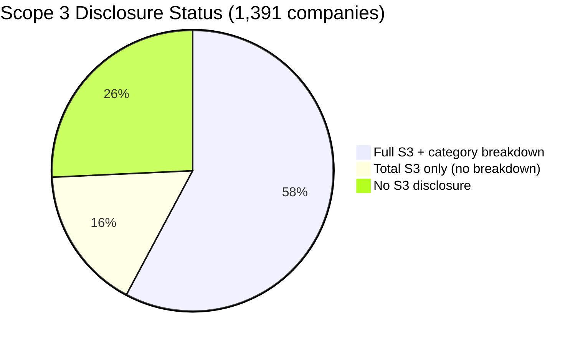
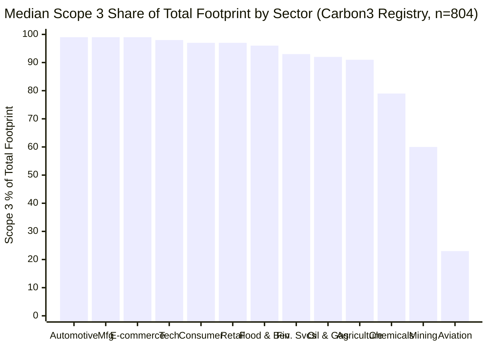
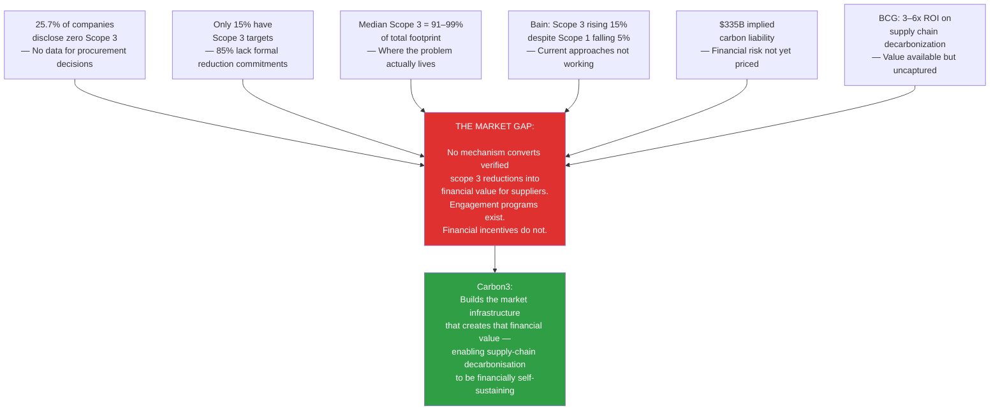

# Industry Data, Benchmarks, and Research Findings

> **Data sources:** Carbon3 Emissions Registry (1,391 global companies, sustainability reports 2022–2025); BCG/CDP Scope 3 Upstream Report (June 2024); McKinsey & Company research (2023–2025); Bain & Company CEO Sustainability Guide (2025); World Economic Forum reports (2023–2025); Ecosystem Marketplace SOVCM (2025).
>
> **Carbon3 Registry note:** All company-level figures are drawn from verified sustainability reports filed by the named companies. Source report URLs are available via the Carbon3 emissions registry API at `demo.carbon3.net/api/emissions-registry`.

---

## 1. The Disclosure Landscape: What the Data Actually Shows

### Carbon3 Registry: 1,391 Companies Across 35 Sectors

Analysis of the Carbon3 emissions registry (companies from 35 sectors, sustainability reports primarily 2023–2024) reveals the current state of Scope 3 disclosure practice:

| Metric | Value |
|--------|-------|
| Companies disclosing *any* Scope 3 | 74.3% (1,033 of 1,391) |
| Companies providing category breakdown | 57.8% (804 of 1,391) |
| Companies with *no* Scope 3 disclosure | 25.7% (358 of 1,391) |
| Most common report year in dataset | 2024 (76% of records) |

**What this means:** Even among companies sophisticated enough to produce sustainability reports (the sample in this registry), over one in four provide no Scope 3 data whatsoever. Among those that do report, 42% report only a total figure without category-level detail — making their disclosures nearly useless for identifying decarbonization levers.

### Sector Disclosure Rates

The sectors with the highest Scope 3 disclosure compliance in the Carbon3 registry:

| Sector | S3 Disclosure Rate | Companies (n) |
|--------|-------------------|---------------|
| Professional Services | 92.1% | 38 |
| Consumer Goods | 90.0% | 30 |
| Technology | 85.2% | 81 |
| Telecommunications | 83.3% | 30 |
| Real Estate | 82.4% | 51 |
| Transportation & Logistics | 80.3% | 66 |
| Retail | 78.9% | 38 |
| Automotive | 78.8% | 33 |
| Financial Services | 77.3% | 75 |
| Manufacturing | 77.4% | 53 |
| **Agriculture** | **62.9%** | **70** |
| **Mining & Metals** | **62.9%** | **62** |
| **Aerospace & Defense** | **52.3%** | **44** |

**The disclosure paradox:** Agriculture and mining — two of the most emissions-intensive and Scope 3-complex sectors — have the *lowest* disclosure rates. The sectors that most need transparency are the ones providing the least.

---

## 2. Scope 3 Intensity: Real Data Across Sectors

Median Scope 3 as a percentage of total (Scope 1+2+3) footprint, by sector, derived from Carbon3 registry:

**Key findings from real company data:**

- **Automotive:** Median 99% — every major OEM in the registry has Scope 3 ≥ 98% of total footprint
- **Manufacturing:** Median 99% — confirms the BCG finding that supply chain emissions dwarf direct operations
- **Financial Services:** Median 93% — driven entirely by financed emissions (Cat 15)
- **Aviation:** Median 23% — airlines are unusual: their Scope 1 (jet fuel combustion) is enormous, making Scope 3 a *smaller* percentage than most sectors, though still material in absolute terms
- **Mining & Metals:** Median 60% — lower than expected due to large Scope 1 process emissions

> **BCG/CDP confirmation (June 2024):** "Supply chain Scope 3 emissions are, on average, 26 times greater than a company's combined Scope 1 and 2 operational emissions." — Source: [BCG/CDP Scope 3 Upstream Report](https://www.bcg.com/press/25june2024-corporates-supply-chain-scope-3-emissions-higher-than-operational-emissions)

---

## 3. Category-Level Analysis: Where the Carbon Actually Is

From Carbon3 registry companies that disclosed category-level breakdowns (n=804):

| Category | Reported By | Avg When Present | Total in Registry |
|----------|-------------|-----------------|-------------------|
| Cat 1 (Purchased Goods & Services) | 77.2% | 10.5 Mt | 6,550 Mt |
| Cat 11 (Use of Sold Products) | 48.3% | **49.5 Mt** | **19,203 Mt** |
| Cat 15 (Investments/Financed) | 33.5% | 12.4 Mt | 3,339 Mt |
| Cat 10 (Processing of Sold Products) | 18.2% | 7.5 Mt | 1,098 Mt |
| Cat 3 (Fuel & Energy Related) | 69.9% | 1.8 Mt | 1,000 Mt |
| Cat 2 (Capital Goods) | 59.2% | 1.6 Mt | 760 Mt |
| Cat 4 (Upstream T&D) | 59.8% | 1.3 Mt | 607 Mt |
| Cat 12 (End-of-Life Treatment) | 37.9% | 1.5 Mt | 447 Mt |
| Cat 9 (Downstream T&D) | 36.8% | 1.4 Mt | 425 Mt |
| Cat 7 (Employee Commuting) | 64.2% | 0.1 Mt | 67 Mt |
| Cat 5 (Waste in Operations) | 62.1% | 0.1 Mt | 42 Mt |
| Cat 6 (Business Travel) | 76.2% | 0.1 Mt | 41 Mt |
| Cat 13 (Downstream Leased) | 27.1% | 0.2 Mt | 52 Mt |
| Cat 8 (Upstream Leased) | 29.2% | 0.1 Mt | 21 Mt |
| Cat 14 (Franchises) | 12.8% | 0.4 Mt | 38 Mt |

**The Category 11 dominance:** Cat 11 accounts for **62.2%** of all Scope 3 emissions in the registry by total volume (19,203 Mt of 30,832 Mt total), yet is reported by only 48.3% of companies. This means most companies are not disclosing the category that typically represents the majority of their actual climate impact.

**The Category 1 paradox:** Cat 1 is reported by the most companies (77.2%) but averages only 10.5 Mt per company — because many companies reporting Cat 1 are in services or light manufacturing where purchased goods emissions are modest. The total of 6,550 Mt across the registry is still the second-largest category by volume.

**The most underreported significant category:** Cat 15 (financed emissions) — reported by only 33.5% of financial institutions in the dataset, yet averages 12.4 Mt per company when present. Financial institutions that do not report Cat 15 are omitting what is typically 98–100% of their total climate footprint.

---

## 4. Real Company Benchmarks: Named Disclosures from the Registry

### 4.1 Automotive OEMs — The Cat 11 Monoculture

| Company | Year | Scope 3 Total | Cat 11 (Use Phase) | Cat 1 (Supply Chain) | S3 as % Total |
|---------|------|--------------|--------------------|--------------------|---------------|
| Volkswagen AG | 2024 | 408.6 Mt | 296.9 Mt (73%) | 87.3 Mt (21%) | 99% |
| General Motors | 2024 | 388.4 Mt | 250.8 Mt (65%) | 90.2 Mt (23%) | 99% |
| Stellantis | 2024 | 412.1 Mt | 367.9 Mt (89%) | 39.2 Mt (10%) | 99% |
| Hyundai Motor | 2024 | 147.3 Mt | 113.6 Mt (77%) | 22.8 Mt (15%) | 99% |
| BMW Group | 2024 | 130.4 Mt | 93.7 Mt (72%) | 31.8 Mt (24%) | 99% |
| Mercedes-Benz | 2024 | 129.4 Mt | 97.3 Mt (75%) | 22.0 Mt (17%) | 99% |
| Renault | 2024 | 107.0 Mt | 84.4 Mt (79%) | 15.7 Mt (15%) | 99% |

*Source: Carbon3 emissions registry, company sustainability reports 2024.*

**Observation:** The variation in Cat 11 share (65–89%) reflects different EV portfolio mixes and use-phase assumptions. Stellantis's unusually high Cat 11 share (89%) reflects its heavy ICE-weighted fleet with limited EV penetration as of reporting year.

**The SBTi compliance crisis:** 

> "Only 28% of automakers are on track to meet their Scope 3 goals. No US automakers are on track with Scope 3 targets, and only 7% of Japanese automakers are meeting them." — NewClimate Institute / Corporate Climate Responsibility Monitor 2025

> "Automotive Tier 1 supplier Scope 3 upstream emissions *increased* 5% between 2017 and the present, even as OEM-level direct emissions fell 8%." — Bain & Company, 2024

The data reveals a structural gap: OEMs have some control over Cat 11 through EV transition (which depends on consumer adoption and grid decarbonization they cannot control), and limited control over Cat 1 because Tier 1 suppliers are themselves failing to decarbonize.

### 4.2 Energy and Industrial Giants — Scale of Cat 11

| Company | Year | Scope 3 Total | Cat 11 | S3 as % Total |
|---------|------|--------------|--------|---------------|
| Cummins Inc. (engines) | 2023 | 1,176.4 Mt | 1,166.7 Mt (99%) | 100% |
| Shell plc | 2024 | 1,084.0 Mt | 845.0 Mt (78%) | 95% |
| Caterpillar Inc. | 2024 | 680.0 Mt | 680.0 Mt (100%) | 100% |
| Exxon Mobil | 2024 | 630.0 Mt | 630.0 Mt (100%) | 85% |
| Airbus SE | 2024 | 485.9 Mt | 474.7 Mt (98%) | 100% |
| TotalEnergies | 2023 | 410.0 Mt | 355.0 Mt (87%) | 90% |
| Mitsubishi Heavy Ind. | 2023 | 850.2 Mt | 842.0 Mt (99%) | 100% |

*Source: Carbon3 emissions registry, company sustainability reports.*

**The Cummins case study:** Cummins makes diesel and gas engines. Its entire Scope 3 (1,176 Mt) is essentially Cat 11 — the lifetime emissions from engines its customers burn fuel through. This is **3,000x** Cummins' own direct operational footprint. The only credible Cat 11 reduction path is transitioning to hydrogen or electric powertrains — which requires decade-scale product development cycles and depends on hydrogen fueling infrastructure that does not yet exist at scale.

**The Airbus paradox:** Airbus's 485.9 Mt Scope 3 is 99% Cat 11 — the fuel burn of aircraft it sells to airlines over their 20–30 year operational lifetimes. Airbus has no direct control over airline operations, SAF adoption, or air traffic levels. Its decarbonization target depends almost entirely on SAF scaling (currently <1% of global jet fuel) and next-generation aircraft development (A320neo family successor: not flying before 2035–2040).

### 4.3 Financial Services — Financed Emissions Reality

| Company | Year | S3 (Financed) | Cat 15 | Own Ops (S1+S2) | Ratio S3:Own Ops |
|---------|------|--------------|--------|-----------------|-----------------|
| SMFG | 2024 | 891 Mt | 891 Mt (100%) | ~0.5 Mt | ~1,800x |
| Banco Santander | 2024 | 286 Mt | 285 Mt (100%) | ~0.8 Mt | ~360x |
| ING Groep | 2024 | 261 Mt | 261 Mt (100%) | ~0.3 Mt | ~870x |
| UniCredit | 2024 | 97 Mt | 97 Mt (100%) | ~0.2 Mt | ~485x |

*Source: Carbon3 emissions registry.*

> "Only 10% of investors require the disclosure of Scope 3 supply chain emissions from their investee companies." — BCG/CDP Scope 3 Upstream Report, June 2024

> "Only half of CDP-reporting companies evaluate the financial risks from their upstream emissions, yet a third of those companies acknowledge risks to profit from Scope 3." — BCG/CDP, June 2024

**The $335 billion liability calculation:**

BCG and CDP estimated that upstream Scope 3 emissions from just three sectors (manufacturing, retail, materials) carried an implied carbon liability of **$335 billion** at the IMF-proposed 2030 carbon floor price of $75/tCO₂e. This calculation uses actual reported Scope 3 data — and only covers a fraction of the total Scope 3 universe.

If extended across all sectors and all companies, the implied liability is orders of magnitude larger.

### 4.4 The Walmart Case Study: What Supplier Engagement Can Achieve

Walmart's **Project Gigaton** is the most cited large-scale Scope 3 supplier engagement program in the world:

- **Target:** Reduce or avoid 1 billion metric tonnes of GHGs from its global supply chain by 2030
- **Result:** Achieved in **2024 — six years ahead of schedule** — with 1.19 billion tonnes of CO₂e avoided
- **Mechanism:** Walmart asked suppliers to set targets and take action across six areas: energy, nature, waste, packaging, transportation, and product use/design
- **Scale:** Walmart's 2024 Scope 3 footprint: **636.6 Mt CO₂e** (98% of its total footprint)

**The critical caveat:** Project Gigaton measures "avoided and reduced emissions" — a metric that includes both actual reductions *and* counterfactual avoidances (what would have happened without the program). The methodology for this calculation has not been independently verified at the granularity needed to confirm that 1.19 Bt of genuine additional reduction occurred. The result demonstrates the *potential scale* of supplier engagement when backed by procurement weight, but does not resolve the additionality verification challenge.

**What Walmart still cannot do:** Despite Project Gigaton's success, Walmart formally declared in 2025 that it will **miss its own Scope 1 and 2 targets** — confirming that supplier engagement and own operations require entirely different intervention types, and that supply chain progress does not automatically transfer to corporate target compliance.

### 4.5 Maersk — Shipping's Scope 3 Complexity

Maersk (A.P. Møller) is the world's largest container shipping operator. Its Scope 3 profile is illustrative of the transportation sector's unique challenge:

| Category | 2024 Reported | % of S3 |
|----------|--------------|---------|
| Cat 4 (Upstream T&D — fuel supply chain) | 23.8 Mt | 48% |
| Cat 11 (Customer products shipped — fuel use) | 9.7 Mt | 20% |
| Cat 3 (Fuel energy-related) | 6.0 Mt | 12% |
| Cat 1 (Purchased goods) | 5.4 Mt | 11% |
| Cat 2 (Capital goods — vessels) | 2.5 Mt | 5% |
| Other categories | 1.9 Mt | 4% |
| **Total Scope 3** | **49.2 Mt** | |
| **Scope 1** (own fuel burn) | **33.9 Mt** | |

*Source: Carbon3 emissions registry, Maersk Sustainability Report 2024.*

**The insight:** For a shipping company, Scope 1 (direct fuel combustion) is enormous — 33.9 Mt, or 41% of total footprint. Maersk's Scope 3 (49.2 Mt) includes both upstream fuel supply chain emissions and downstream emissions from the products it transports. This makes shipping the only major sector where Scope 3's share of total footprint (53%) is barely above 50% rather than the 90%+ seen in most asset-light sectors.

Maersk has committed to net-zero by 2040 and has ordered 19 methanol-powered vessels. Green methanol fuel switching (the type of project Carbon3 targets in maritime) could reduce Cat 4 and Scope 1 simultaneously — making it one of the highest-leverage interventions in the shipping sector.

---

## 5. Research Findings: The Financial Case for Action

### BCG/CDP: The Financial Risk That Boards Are Ignoring

From the BCG/CDP Scope 3 Upstream Report (June 2024), based on 23,000+ CDP-reporting companies:

| Finding | Data |
|---------|------|
| Supply chain S3 vs. operational S1+S2 | **26x** higher on average |
| Companies measuring S3 vs. S1+S2 | Companies are **2x more likely** to measure S1+S2 |
| Companies with S3 reduction targets | Only **15%** have set any S3 target |
| Companies evaluating S3 financial risk | Only **50%** |
| Of those, acknowledging profit risk | **33%** |
| Investors requiring S3 disclosure | Only **10%** |
| Implied carbon liability (3 sectors) | **>$335 billion** at $75/tCO₂e |
| Boards with climate-competent oversight | Only **34%** |

> **The board effect:** Companies with climate-competent boards are **4.8x more likely** to adopt 1.5°C-aligned Scope 3 targets. Companies actively engaging suppliers are **7x more likely** to set aligned targets. Companies using internal carbon pricing are **4x more likely** to set aligned targets. — BCG/CDP, 2024

### McKinsey: The Cost of Inaction vs. Cost of Action

McKinsey research identifies the financial stakes of Scope 3 management:

- Companies pursuing aggressive Scope 3 strategies could avoid **$120–$150 billion in cumulative carbon costs** across global supply chains by 2035 (McKinsey, 2025)
- For retailers specifically: if decarbonization actions were deployed at scale, they could drive a **55–65% reduction in average retailer Scope 3 emissions by 2030** — but actions that reduce or don't increase costs could achieve **12–17%** without additional investment (McKinsey Retailer Climate Roadmap)
- For manufacturing: companies that integrate decarbonization into operations see **3–6x return on investment** from energy efficiency and waste reduction alone, before counting any carbon pricing benefit (BCG/EcoVadis 2025)

> "Operational changes required to reduce Scope 1 and Scope 2 emissions are within the control of the company. Scope 3 can be tackled *only* by collaborating with customers and suppliers." — McKinsey & Company

### Bain: Supply Chain Decarbonization in Practice

From Bain's 2025 CEO Sustainability Guide (analyzing PE portfolio companies 2021–2023):

- Median **5% decrease** in Scope 1 emissions
- Median **26% decrease** in Scope 2 emissions (primarily from renewable energy procurement)
- Median **15% *increase*** in Scope 3 emissions — even as Scope 1 and 2 fell

> "Scope 3 emissions, which are generated by suppliers and customers and are the largest category of emissions, are proving harder for this group to reduce." — Bain & Company, 2025 CEO Sustainability Guide

This Bain finding is arguably the most important single data point for understanding the state of corporate Scope 3 management: companies are succeeding at what they control (Scope 1 and 2) while their Scope 3 continues to grow. The gap between ambition and supply chain reality is widening, not closing.

> "Upstream Scope 3 accounts for more than 50% of all emissions in apparel, food and beverage, chemicals, and retail." — Bain, 2024

---

## 6. The Voluntary Carbon Market: Context for Inset Pricing

The voluntary carbon market (VCM) provides the pricing context for any credit-based supply chain mechanism:

| Metric | Value (2024) |
|--------|-------------|
| Total credits retired | ~182 million tonnes |
| Total market value | ~$535 million |
| Average price per credit retired | ~$2.94/tCO₂e |
| High-quality industrial credits | $15–$40/tCO₂e |
| Nature-based offsets (post-scandal) | $2–$8/tCO₂e |
| VCM projected CAGR (2024–2030) | 34.6% |

*Source: Ecosystem Marketplace State of the Voluntary Carbon Market (SOVCM) 2025.*

> "Transaction volumes fell by 25% in 2024, but credit prices declined by only 5.5% and retirements held fairly steady, indicating that underlying demand remains resilient even amid broader market pressures." — SOVCM 2025

**The pricing gap for hard-to-abate sectors:**

The $2–$40/tCO₂e VCM price range must be compared against the abatement cost for hard-to-abate interventions:

| Intervention | Abatement Cost ($/tCO₂e) | Credit Revenue Covers? |
|-------------|--------------------------|----------------------|
| Supplier renewable energy | -$20 to +$10 | Yes — credits likely increase ROI |
| Fuel switching (LNG, methanol) | $20–$80 | Partially — credits help |
| Green hydrogen (steel, chemicals) | $150–$300 | No — major gap remains |
| Carbon capture (cement) | $80–$200 | Partially at best |
| Sustainable aviation fuel | $150–$400 | No — SAF needs policy + blending mandates |
| Direct air capture | $300–$1,000+ | No — far beyond VCM pricing |

**Implication:** For lower-cost interventions (renewable energy, fuel switching, regenerative agriculture), inset credit revenue can meaningfully shift the business case for suppliers. For hard-to-abate sectors, credits are a contribution to a blended finance stack but cannot be the primary funding mechanism.

---

## 7. Sector Deep-Dives: What the Carbon3 Registry Reveals

### 7.1 Technology Sector (n=81 companies, 85% S3 disclosure rate)

- Median Scope 3 share: **98%** of total footprint
- Average Scope 3 when disclosed: **8.6 Mt** per company
- Primary categories: Cat 1 (hardware supply chain), Cat 11 (use phase of sold products), Cat 3 (data center energy)

**The hardware supply chain problem:** For semiconductor and hardware companies, Cat 1 includes the emissions from chip fabrication — one of the most energy-intensive manufacturing processes per unit of value. A leading fab can consume 1–2 TWh/year of electricity for a single production line. With Taiwan's grid at ~0.5 kg CO₂/kWh (and growing more fossil-dependent due to nuclear phase-out), the embedded carbon per chip is rising even as chips become more energy-efficient in use.

**The "cloud as Scope 3" problem:** For enterprise software companies, their Cat 1 includes the emissions from cloud computing services (AWS, Azure, GCP) used to deliver their products. As hyperscaler data centers grow, so does this category — yet software companies typically have no access to the actual energy consumption data of individual compute workloads.

### 7.2 Food & Beverage (n=36 companies, 77.8% S3 disclosure rate)

- Median Scope 3 share: **96%** of total footprint
- Average Scope 3 when disclosed: **31.4 Mt** per company
- Primary categories: Cat 1 (agricultural raw materials, including LUC), Cat 11 (consumer cooking/refrigeration)

**The deforestation accounting gap:** Of the 28 food & beverage companies in the registry disclosing Scope 3 breakdowns, only 4 separately quantify land use change (LUC) emissions within their Cat 1 disclosure. The remainder use commodity average emission factors that typically undercount LUC by 30–80% for tropical commodities.

**Notable: AAK AB (edible oils, Sweden)** — 2024 Scope 3: 4.18 Mt vs. own ops (S1+S2): 294k tonnes. Ratio of 14:1. AAK sources palm oil, rapeseed, shea, and other specialty fats — making its Cat 1 LUC exposure one of the key material Scope 3 risks in the specialty oils sector.

### 7.3 Agriculture (n=70 companies, 62.9% S3 disclosure rate)

The lowest disclosure rate of any major sector — and the most important for food system decarbonization:

- Of 70 agricultural companies in the registry, only 44 disclose any Scope 3
- Average Scope 3 when disclosed: **21.6 Mt** — but this likely vastly understates actual LUC and methane emissions for vertically integrated agricultural companies
- The 37% non-disclosure rate in a sector where the GHG Protocol itself notes Scope 3 can include "cradle-to-gate" agricultural emissions is a significant gap

### 7.4 Insurance (n=64 companies, 78.1% S3 disclosure rate)

- Median Scope 3 share: **85%** of total footprint
- Average Scope 3: **4.75 Mt** (primarily investment portfolio emissions)
- PCAF coverage for insurance is the least developed of any financial sector — insurance liabilities (claims from climate-related events) are a financial risk but not a GHG accounting item

Insurance companies face a unique Scope 3 problem: their investment portfolios generate financed emissions (Cat 15), but their underwriting portfolios — which provide insurance to carbon-intensive industries — are not captured in the GHG Protocol framework at all. A coal mine cannot get insurance if insurers exit the sector; but that underwriting decision does not appear in any Scope 3 category.

---

## 8. The Target-Setting Gap

> "Companies are 2.4 times more likely to set Scope 1 and 2 reduction targets than Scope 3 reduction targets." — BCG/CDP, June 2024

> "Only 15% of corporations disclosing to CDP have set a Scope 3 target." — BCG/CDP, June 2024

From the Carbon3 registry supplemented by SBTi data (as of early 2026):

| Target Type | % of Large Companies |
|-------------|---------------------|
| Have any net-zero/carbon neutral commitment | ~75% (Fortune 500) |
| Have Scope 1+2 SBTi target | ~40% |
| Have Scope 3 SBTi target (required or voluntary) | ~25% |
| On track to meet Scope 3 target | <10% |

The gap between "having a target" and "being on track" is the defining challenge of the 2025–2030 period. PwC's 2025 analysis of the automotive sector found that only 28% of automakers were on track — and automotive is one of the *better-performing* sectors for Scope 3 target-setting.

> "Bain's PE portfolio analysis found median Scope 3 emissions *rose 15%* between 2021 and 2023, even as Scope 1 fell 5% and Scope 2 fell 26%. The direction of travel at the operational level is not translating into value chain improvement." — Bain, 2025

---

## 9. What This Data Means for the Inset Credit Market

The Carbon3 registry data, combined with BCG/CDP/McKinsey/Bain research, makes a strong empirical case for why a financial market mechanism for supply chain Scope 3 reductions is structurally necessary:

**The core empirical argument:**

- Companies with the *largest* Scope 3 footprints (automotive, manufacturing, financial services) have median Scope 3 = 99% of total
- Those companies have the *least* tools to address it (no financial mechanism to incentivize suppliers)
- The market size of the problem ($335B implied liability from 3 sectors alone at 2030 carbon prices) dwarfs the current VCM ($535M total in 2024)
- The ROI on supply chain decarbonization (3–6x per BCG) exists but is uncaptured because there is no mechanism to allocate value between buyers and suppliers

This is not a technology problem. It is a market design problem. The Carbon3 inset credit infrastructure is designed to solve the market design problem — creating the price signal, the verification infrastructure, and the trading mechanism that allows supply chain carbon to be valued, financed, and reduced.

---

## Sources

- [BCG/CDP: Scope 3 Upstream: Big Challenges, Simple Remedies (June 2024)](https://www.bcg.com/press/25june2024-corporates-supply-chain-scope-3-emissions-higher-than-operational-emissions)
- [BCG: Liability to Advantage — Decarbonizing the Supply Chain (2025)](https://www.bcg.com/publications/2025/liability-to-advantage-decarbonizing-supply-chain)
- [McKinsey: Making Supply-Chain Decarbonization Happen](https://www.mckinsey.com/capabilities/operations/our-insights/making-supply-chain-decarbonization-happen)
- [McKinsey: Retailers' Climate Road Map](https://www.mckinsey.com/capabilities/sustainability/our-insights/retailers-climate-road-map-charting-paths-to-decarbonized-value-chains)
- [Bain: Operations and Supply Chain Decarbonization — Lower Emissions, Higher Performance (2023)](https://www.bain.com/insights/operations-and-supply-chain-decarbonization-lower-emissions-higher-performance-ceo-sustainability-guide-2023/)
- [Bain: Capturing Value by Decarbonizing the Automotive Supply Chain](https://www.bain.com/insights/capturing-value-by-decarbonizing-the-automotive-supply-chain/)
- [Bain: CEO Sustainability Guide 2025 — Private Equity Decarbonization](https://www.bain.com/insights/decarbonization-that-works-five-key-actions-in-private-equity-ceo-sustainability-guide-2025/)
- [Ecosystem Marketplace: State of the Voluntary Carbon Market 2025](https://www.ecosystemmarketplace.com/articles/sovcm-2025-finds-the-voluntary-carbon-market-in-transition-demand-holding-steady-as-turnover-stabilizes/)
- [NewClimate Institute: Corporate Climate Responsibility Monitor 2025 — Automotive](https://newclimate.org/resources/publications/corporate-climate-responsibility-monitor-2025-automotive-sector)
- [WEF: "No-Excuse" Opportunities to Tackle Scope 3 in Manufacturing (2023)](https://www3.weforum.org/docs/WEF_No-Excuse%E2%80%9D_Opportunities_to_Tackle_Scope_3_Emissions_in_Manufacturing_and_Value_Chains_2023.pdf)
- [Walmart Project Gigaton: 1B tonnes achieved 6 years early (ESG Today, 2024)](https://www.esgtoday.com/walmart-hits-goal-to-reduce-1-billion-tons-of-supply-chain-emissions-6-years-ahead-of-2030-target/)
- [Carbon3 Emissions Registry API: demo.carbon3.net/api/emissions-registry](https://demo.carbon3.net/api/emissions-registry)
