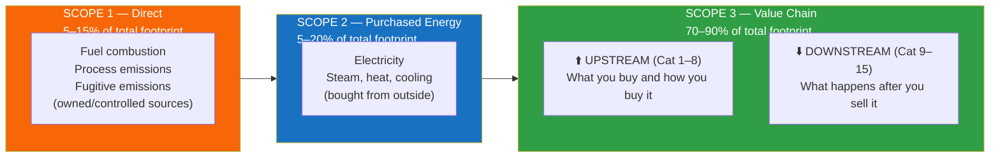

# Scope 3 Emissions: The Hardest Problem in Corporate Climate Action

> A structured knowledge base on Scope 3 GHG accounting — from first principles to regulatory detail to real company data.

---

## TL;DR

- **Scope 3 = 70–90% of most companies' real climate footprint** — yet it is largely invisible, estimated, and underreported.
- The problem is structural: data gaps, misaligned incentives between buyers and suppliers, standard fragmentation, and the absence of any market mechanism to finance supplier action.
- The companies that will win the transition are not those who report best — **they are those who build operational infrastructure to *manage* Scope 3.**

---

## Start Here: Choose Your Path

| I am... | Start with | Then go to |
|---------|-----------|-----------|
| **Executive / Board member** | [00 Executive Summary](00_executive_summary.md) | [04 Abatement Challenges](04_abatement_challenges.md) |
| **Sustainability / ESG lead** | [01 Fundamentals](01_scope3_fundamentals.md) | [02 Complexity](02_complexity_challenges.md) → [06 Standards](06_standards_regulatory.md) |
| **Finance / Risk team** | [06 Standards & Regulatory](06_standards_regulatory.md) | [03 Case Studies — Banking](03_industry_case_studies.md) |
| **Procurement / Operations** | [03 Industry Case Studies](03_industry_case_studies.md) | [04 Abatement Challenges](04_abatement_challenges.md) |
| **Technologist / Data team** | [02 Complexity & Challenges](02_complexity_challenges.md) | [07 Data & Benchmarks](07_industry_data_and_benchmarks.md) |

---

## The Three Scopes at a Glance

> **The implication:** Corporate climate pledges that cover only Scope 1 and 2 address at most 30% of a company's actual climate impact.

---

## Guide Index

| # | File | Contents | Best for |
|---|------|----------|---------|
| 00 | [Executive Summary](00_executive_summary.md) | Key insights, maturity model, guide map | All audiences — start here |
| 01 | [Scope 3 Fundamentals](01_scope3_fundamentals.md) | GHG scopes, all 15 categories, double-counting mechanics | ESG leads, new practitioners |
| 02 | [Complexity & Challenges](02_complexity_challenges.md) | Data pyramid, incentive traps, emission factor uncertainty, attribution conflicts | Technical teams, data architects |
| 03 | [Industry Case Studies](03_industry_case_studies.md) | Automotive, apparel, banking, food & ag — deep dives with value chain maps | Procurement, sector specialists |
| 04 | [Abatement Challenges](04_abatement_challenges.md) | Why measuring ≠ reducing; lever map by category; decarbonization playbook | Executives, operations leaders |
| 05 | [Carbon3 Solution](05_carbon3_solution.md) | The inset credit model and market infrastructure — with rigorous critical analysis | All audiences |
| 06 | [Standards & Regulatory](06_standards_regulatory.md) | GHG Protocol, PCAF, SBTi, CSRD, SEC Rule, ISSB S2, VCMI, CSDDD, PACT | Finance, legal, compliance |
| 07 | [Industry Data & Benchmarks](07_industry_data_and_benchmarks.md) | Real data from 1,391 companies, BCG/CDP/McKinsey/Bain research, VCM pricing | Analysts, researchers |

---

## Why This Exists

Scope 3 accounting is not merely difficult — it is *structurally* difficult. The challenges are rooted in information economics, organizational incentives, system boundary design, and the nature of distributed global supply chains.

This guide was built to provide the most rigorous, non-promotional treatment of those challenges available in one place — and to be honest about what remains unsolved.

The guide culminates in [05 Carbon3 Solution](05_carbon3_solution.md), which describes how **[Carbon3](https://carbon3.net)** is building the market infrastructure that makes supply-chain decarbonisation financially self-sustaining: the inset credit mechanism, an independent verification layer, and a live marketplace for traded supply-chain emission reductions. That section includes a frank critical analysis of the open questions and risks — because the problem deserves honesty, not sales copy.

---

## Data Sources

The benchmarks and company-level analysis in [07 Industry Data & Benchmarks](07_industry_data_and_benchmarks.md) draw on:

| Source | Coverage |
|--------|---------|
| **Carbon3 Emissions Registry** | 1,391 global companies across 35 sectors, sustainability reports 2022–2025 |
| **BCG / CDP Scope 3 Upstream Report** (June 2024) | Supply chain emission intensity across sectors |
| **McKinsey & Company** (2023–2025) | Decarbonization economics and transition finance |
| **Bain & Company CEO Sustainability Guide** (2025) | Corporate maturity and target-setting |
| **World Economic Forum** (2023–2025) | Multi-stakeholder system-level analysis |
| **Ecosystem Marketplace SOVCM** (2025) | Voluntary carbon market pricing |
| **DP World Insetify Programme** (2025–2026) | Maritime inset credit operational data |

Registry data is available via the Carbon3 API: `demo.carbon3.net/api/emissions-registry`

---

## What Maturity Looks Like

| Level | Accounting Quality | Abatement Action | ~% of Fortune 500 |
|-------|-------------------|------------------|------------------|
| **1 — Absent** | No Scope 3 disclosure | None | ~15% |
| **2 — Awareness** | Spend-based estimates, some categories | Ad hoc supplier engagement | ~45% |
| **3 — Measurement** | Hybrid/primary data for material categories | Supplier scorecards | ~30% |
| **4 — Management** | Near-complete coverage, verified data | Supplier decarbonization programs | ~8% |
| **5 — Transformation** | Real-time supply chain carbon intelligence | Embedded carbon pricing in procurement | ~2% |

Most Fortune 500 companies are at Level 2. The [05 Carbon3 Solution](05_carbon3_solution.md) describes the market infrastructure designed to help companies move from Level 2–3 to Level 4–5.

---

## Contributing

Corrections, updated data, additional sector case studies, and regulatory updates are welcome. Open an issue or pull request. Please include a source citation for any factual claims.

---

*Built by [Carbon3 Global Pte. Ltd.](https://carbon3.net) — building the market infrastructure that makes supply-chain decarbonisation financially self-sustaining.*

